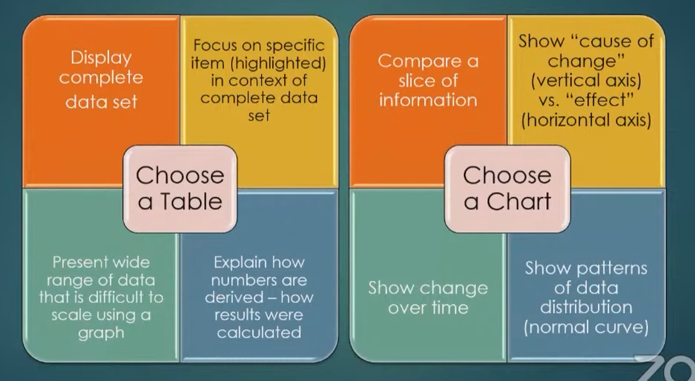
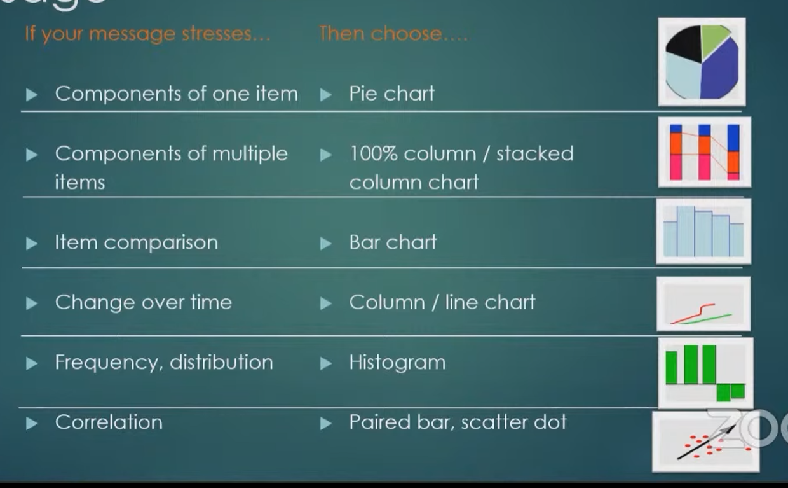
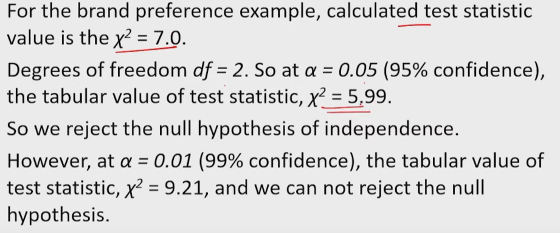

# Business Analytics

There is a few things to remember when we make a visualization.

- Known Purpose: We should know **why** each object is present in the visualization.

- Ensure integrity: Do not represent data in a way that does not distort the truth. 

- Maximize data ink and minimize non data ink: Make sure that the data is as well and as much represented as possible. Try to not waste ink on things that are not data.

- Annotate your data: Make the data more readable. If a bar graph has a scale but not data marking, it is hard to see the values of the bars.

When we decide to visualize data we should:

1. What do I want to communicate?

2. How do I communicate it? What form?

3. How do I design it so that it is easy to understand the purpose and data?

Which graph do we use?

Use annotations rather than a legend. Don't hesitate for a descriptive title.

### Dashboard

It is a visual display of the most important information needed to achieve one of more objectives that has been consolidated on a single screen so it can be monitored and understood at a glance. 

A dashboard doe snot have to be "interactive". Its often better if it is not. 

---

*Week 2*

Trace driven simulation is directly entering data.

We can also "fit" it to another know distribution.

Or make our own distribution (empirical distribution)

Positive skew mean right tail is mode ie lower flat on RIGHT SIDE

So after we choose a distribution we have to check **Goodness of fit.** We can do this through a few options:

1. Frequency comparison (too complex so not notes or discussion)

2. probability plots

3. goodness of fit tests

#### 2. Q-Q plot quantile-quantile plot

#### 2. P-P plot probality-probability plot

q-q highlights tails difference. p-p highlights middle.

#### 3. chi-square test

$$
\chi^2 = \sum_{i=1}^{K} \frac{(O_i - E_i)^2}{E_i}\\
O_i\ is\ observed\ value\\
E_i\ is\ expected\ value
$$

Now we calc p from this can we see if it is less than $\alpha$ . If yes then reject. 

Another way is $\chi_{tabulated}^{2} < \chi_{computed}^{2}$ no clue what these are.

#### 3. kolmogorov smirnov test the hell is this

---

*Week 3*

If a categorical data can be in a NATURAL order then it is a ordinal data.

$$
Pr(A|M) = \frac{Pr(M \cap A)}{Pr(M)}
$$

This is Probability of M occurring IF A has occurred. 

This is observed.

| CITY  | A   | B   | C   | Total |
| ----- | --- | --- | --- | ----- |
| Mum   | 279 | 73  | 225 | 577   |
| Cheni | 165 | 47  | 191 | 403   |
| Total | 444 | 120 | 416 | 980   |

$Expected = \frac{Row\ Total * Column\ Total}{TOTAL}$

| CITY  | A     | B   | C   | Total |
| ----- | ----- | --- | --- | ----- |
| Mum   | 261.4 | ... | ... | 577   |
| Cheni | 182.6 | ... | ... | 403   |
| Total | 444   | 120 | 416 | 980   |

This is for $\chi^2$ test. Larger this is, less independent the categories are.

$degree\ of\ freedom = (row-1)*(column-1)$

---

*Week 4*

Demand price curve. Price sensitivity has 2 ways to be measured. Slope (change in d/change in p) and elasticity (% change in d / % change in p)

Elasticity is $\frac{(d(p_1)-d(p_2))/d(p_1)}{(p_2-p_1)/p_1}$ . PUT abs func EVERYWHERE cuz goddamn economists couldn't come up with a cleaner formula. Use logic to decide when to flip signs. Take "changed price" as first price.

Market size is when price = 0. 

Saciating price is P max ie demand is 0. For linear regress there is no point for some reason.

***End for quiz 1***

---