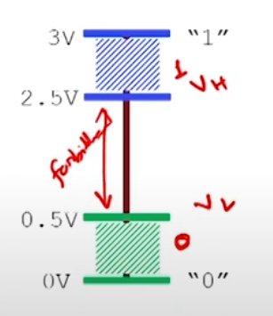

# Computer Systems Design

## Week 1

Moore's Law said that the number of transistors doubles every two years. It is no longer true because of physical and thermal limitations.

Storage of bits is done using voltage. 

The forbidden zone helps avoid changes from noise and other degrading factors. Make tricks for non standard number systems. If no options, usually 7.

---

# END OF WEEK 1

---
