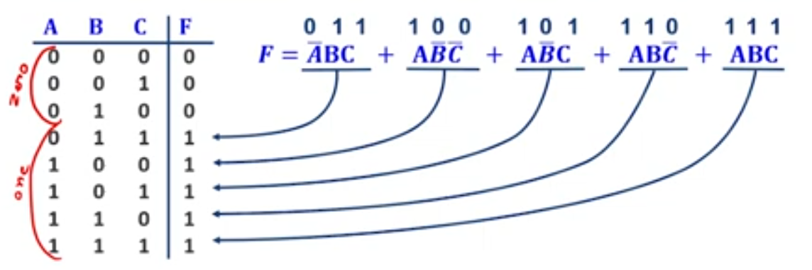

# Computer Systems Design

## Week 2

### Combinational logic:

It is memoryless and output is strictly dependent on the current input values.

### Sequential logic:

It has a memory and output is dependent on the current input and stored value.

### Function:

It is unique, not ambiguous and is not dependent on memory.

---

### Boolean Algebra:

It is the NOT, AND, OR stuff.

$$
Distributive\ Laws:\\
a+(b*c) = (a+b)*(a+c)\\
AND\\
a*(b+c) =(a*b) + (a*c)
$$

 Rest rules are normal algebra.

#### Duality:

A dual of a boolean expression is made by:

- replacing AND with OR

- replacing OR with AND

- replacing constant 1s with 0s

- replacing constant 0s with 1s

A boolean expression is EQUAL to its dual version.

We can simplify equations and expressions by moot substitution.

#### DeMorgans's Law:

$$
\overline{a*b*c...} = \bar{a}+\bar{b}+\bar{c}+ ...\\
\overline{a+b+c...} = \bar{a}*\bar{b}*\bar{c}* ...
$$

---

### Sum of Products:

This is a way to express a function in standard terms.

- We only keep combinations that result in 1

Now the function is a OR of all input combinations that result in a 1.

Normalized minterm.

#### Impicant:

It is AND of some literals.

#### Minterm:

It is AND that includes all literals.

$\sum{m(1,3,4,7)}$ means u make the truth table for the inputs and take the 2nd, 4th .. values and ADD(+) them up

#### Maxterm:

It is OR that includes all literals.

### Operator precedence:

- NOT (-)

- AND (*)

- OR (+)

#### Canonical form:

It is a standard way to express with a unique algebraic signature.

#### Product of sum is just reversed SOP:

You take where there is 0 and ignore 1. If literal is 1 then it is bar.

---

# END OF WEEK 2

---
