# Deep Learning

## Week 1

### History of deep learning:

Deep learning is inspired by the biology of the brain i.e. the network of neurons. This is translated to perceptrons in computer science. 

Jordan network was a RNN that introduced context to NLP and video processing.

:)

---

## Week 2

Linearly separable is essentially when one straight line can't divide the solution plane into the required sets. 

See above for XOR. This is to say that one perceptron can only handle a linearly separable data. We have $2^{2^n}$ boolean functions for n inputs.

A few terms to remember:

* $w$ is weight. This applied to an input.

* $h$ is usually the output from a perceptron.

* $b$ or $bias$ is usually added in the end , just before evaluation of a function.

So formula is usually: $w_0*i_0 + ... + b <condition> <some\ value>$ so for example: $w_0*i_0 + ... + b \ge 0$ If that is true then we have some output else some other output.

Input layer is not a perceptron. Hidden and output layers are perceptrons.

Things like sigmoid function help with non boolean implementations. So there are smooth transition between True and False.

This is usually applied to the final output. 

Full formula here is 

$output = \frac{1}{1+r^{-(w_1x+b_1)}}$ 

### Error:

Error is used to guide the algorithm.

Taylor series is a way of approximating a continuously differential function.

The higher the order of the function we consider the higher the "accuracy" will be.

This is gradient descent formula

Gradient is the collection of the partial derivatives. Matrix thingy. In gradient descent we move opposite to the gradient because that is where the loss reduces the most.

Let's say this is loss function. $f(x)$ is the prediction.

Change in weights is partial derivation (w and then b) of this.

$w_1 = w_0-\eta(\frac{df}{dw})$

REVISE THE BASIC INTEGRATION AND DERIVATION RULES!!!

We can approximate any function with $x$ number of towers.

We only need 2 neurons to make a tower, in 2d. and only 1 $x$. To get a "closed tower in 3d we use 4 neurons. 

Now if we add this to another sigmoid and set it so the all output above one stays the we get, .

---

## Week 3

Softmax is

$\frac{e^{aL_j}}{\sum_{i=1}^k{e^{aL_j}}}$

\>:( Softmax bounds to 0-1.

Cross entropy loss is $L(\theta) = -\sum_{c=1}^k{y_clog\ \^{y_c}}$

Now since we use this for probability, the formula simplifies into $l(\theta)= -log\ \^{y_l}$ where $l$ is the True class.

a is value pre-activation function and h is value post-activation function.

---

## Week 4

### Momentum based Gradient Descent:

This is  mainly made to make GD faster.

formula is  

$$
u_t = \beta u_{t-1} + \nabla w_t\\
u_0 = \nabla w_0 \\
u_1 = \beta u_o + \nabla w_1 \\
...
$$

$\beta$ is usually less than 1,, so  the weightage for thee older changes decreases.

Generally M-GB will overshoot and oscillate back into the solution, but even with this it is still faster than regular GB.

### Nesterov Accelerated Gradient Descent

$$
u_t = \beta u_{t-1} + \nabla (w_t - \beta u_{t-1}) 
$$

Essentially we move by $\beta u_{t-1}$ and then we calculate w based on the new position, this helps in reducing momentum in the incorrect direction. 

### Stochastic GD:

Stochastic uses only one point. This is stupid so we used batches instead. Instead of taking all points to make GD we use as few points as we can. This makes it **much cheaper than** GD???. Higher $k$ is more accurate it will be. $k$ in programs are usually called `mini_batch_size`. This can be added onto NAG and MGD.

Now rather than these if we change learning rate, we run into the same oscillation problem, this can be solved by annealing the learning rate. One way s step delay, which halves after every 5 or so epochs. We can also cap the momentum.

Line search evaluates a bunch of learning rates.

For stochastic number of epochs x number of points

For line search just number of epochs

---

## Week 5

A sparse input does not imply that the input is unimportant. So we should change learning rate for these as well. All of the above are not very good when it comes to sparse inputs. They will eventually reach the correct conclusion but it will take more epochs/effort than desired.

Consider weights and inputs as vectors/matrix from no on.

### AdaGrad

$$
v_t = v_{t-1} + \nabla w_t^2\\

w_{t+1} = w_t - \frac{\eta}{\sqrt{v_t+\epsilon}}*\nabla w_t
$$

While adagrad is more "optimized" for sparse, MGD and NAG are still faster. 

We want $\frac{\eta}{\sqrt{v_t+\epsilon}}$ to "decay" so that the sparse values can more effectively add to the history.

AdaGrad does this effectively and sometimes too effectively. When this goes too far, non-sparse factors start to slow down in unintentional ways. 

This is solved with RmsProp

#### RMSProp

The change is we reduce the ability for the history to grow. This is doe by a small change in the formula

$$
v_t = \beta v_{t-1} + (1-\beta)\nabla w_t^2\\
i.e.\\
v_t = (1-\beta)\sum_{T=0}^t{\beta^{t-T}\nabla b_t^2}
$$

$\beta$ is between 0 and 1. So this exponentially decays the history. RMSProp is *much* quicker, however it can oscillate around the minima and can potentially never reach the optimal position. It oscillates because of the exponential decay of the history so the learning rate can become constant. AdaGrad does not have this issue, RMSProp can avoid this b varying the initial learning rate. 

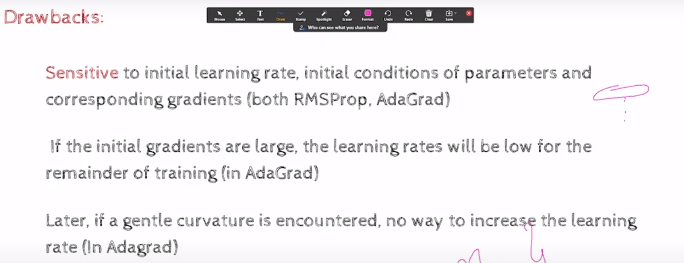

### AdaDelta

This avoids setting an initial $\eta_0$.  This uses the ratio of 2 histories as the learning rate.

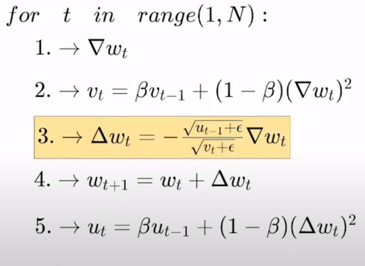

WARNING THERE IS DELTA $\Delta$ AND NABLA $\nabla$ HERE

$u_t$ effectively has older history.   

[This video has all the above algorithms going with the same parameters.](https://s3.amazonaws.com/media-p.slid.es/videos/1839032/MyTPCuSM/gd_mgd_nag_adagrad_rmsprop_adadelta_1.mp4)

AdaDelta is the fastest by far.

### Adam

This is adaptive movements.      

$$
m_t = \beta_1 m_{t-1} + (1-\beta_1)\nabla w_t\\
\^{m_t} = \frac{m_t}{1-\beta_1^t}\\
v_t = \beta_2 v_{t-1} + (1- \beta_2) (\nabla w_t)^2\\
\^{v_t} = \frac{v_t}{1-\beta_2^t}\\
w_{t+1} = w_t - \frac{\eta}{\sqrt{\^{v_t}}+\epsilon}m_t
$$

The hat thing  is called bias correction. This is done to make sure that the initial learning rates are not ridiculous.

### L normalization

$$
L^p = (|x_1|^p + |x_2|^p + ... + |x_n|^p)^\frac{1}{p}
$$

### Adamax

This uses the max of the recent few of the history. 

### NAdam

Nesterov Adam. Same concept as the previous Nesterov. 

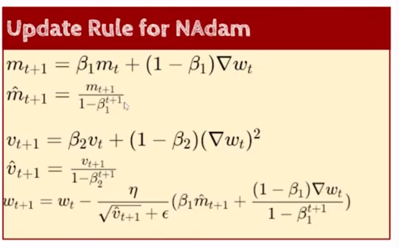

### Learning rate schemes

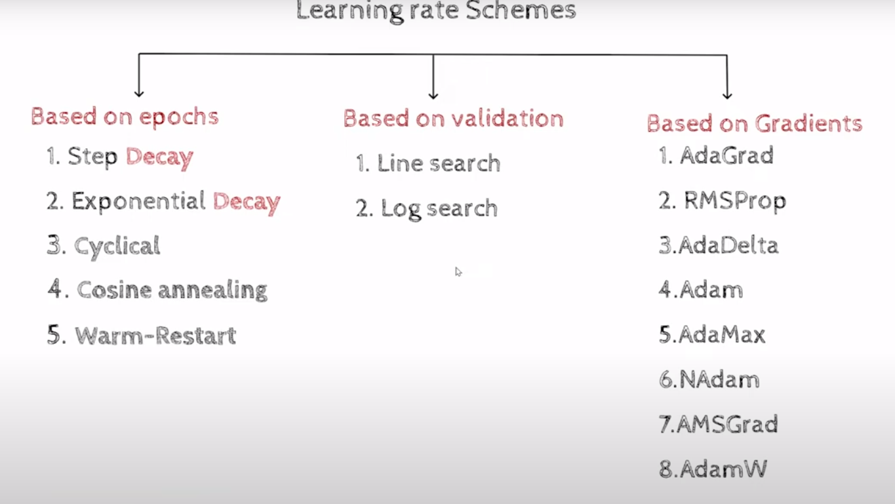

#### Cyclic

There are chances that the  model settles in a saddle point..In this case,, often that minima is not escapeble because of a low  learning rate, so what cyclic does is it sets a min $\eta$ and max $\eta$ , and it increases in a cyclic motion. Usually a triangle signal.

#### Cosine aneeling

similar to above but shape is like below. This is called warm restart because of the jump.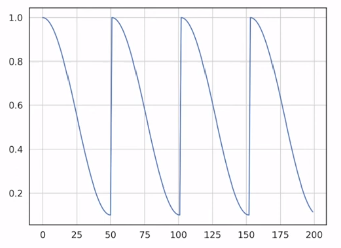

---

## Week 6

### Bias and variance

Over parameterized models tend to overfit and are sensitive to training data. (Some even have more parameters than data points)

Bias here is  the difference between the average produced value and average expected value. 

Variance is the difference between different runs of the same model. $\^f(x) = E[(\^f(x)-E[\^f(x))^2]$ this is standard deviation formula it seems.

Model complexity tends to always reduce training error. On test data there is a  sweet spot and beyond that the test error start increasing again (Overfit)

#### True error and model complexity:

$\Omega (\theta)$ is empirical training error, it increases as the training error decreases. We use normalization/ regularization to solve this issue.

### Regularization

#### L2 Regularization

$\~L(w) = L(w) + \frac{\alpha}{2}||w||^2$

This kinda sets a boundary for potential values for w. 

For SGD:

$w_{t+1} = w_t - \eta \nabla L(w_t) - \eta \alpha w_t$

update rule is above.

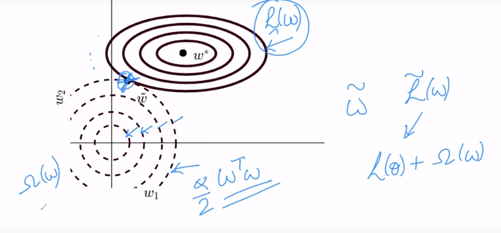

The brow line are increasing loss values, we can see $w_1$ decreases a lot more than $w_2$. This is because a change in $w_1$ has a much smaller impact on loss. Look at it like a contour map.

L2 tends to increase training error and decrease testing error. it also reduces complexity by making unimportant parameters tend towards 0.

#### Dataset Augmentation

This is another regularization method. This is something like rotating an image a bit or shifting etc. This is also to prevent overfitting. Also works for speech.

#### Noise addition to inputs

This helps the network be more flexible.

#### Noise addition to outputs

We replace hard targets with soft targets. So if we have [0,0,1,0] we replace with $[\frac{\epsilon}{4},\frac{\epsilon}{4},1-\epsilon,\frac{\epsilon}{4}]$ where $\epsilon$ is a small positive constant.

#### Early stopping

We check if validation error is reducing. Once it stagnates, we go back to the lowest validation error model we had. I allows "t" changes to parameters.

have heart attack :) :heart:

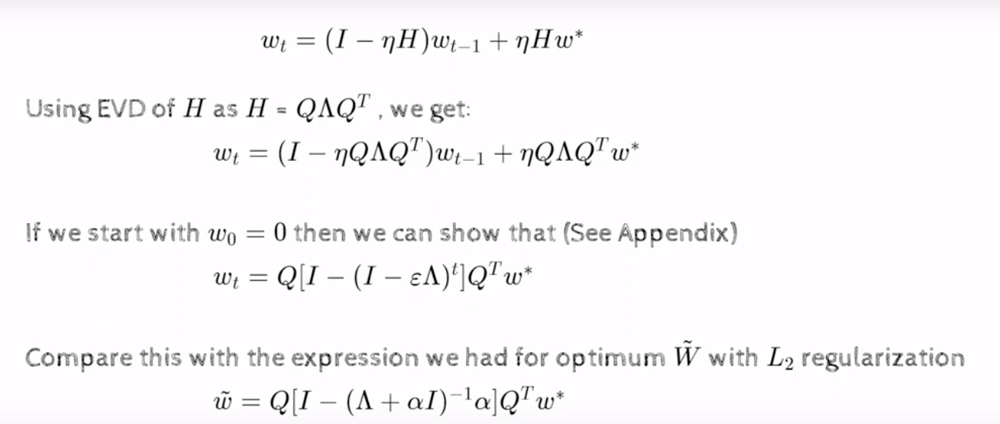

Ignore this lol.

### Ensemble

Ensemble is taking votes from different models.

#### Bagging

Same model, different dataset. 

### Dropout

Let's say a neural network has n nodes, we drop m nodes from the network and train tat network. Each node has a probability of being dropped out.

This is done for each epoch, m nodes participate in forward and backward propagation.

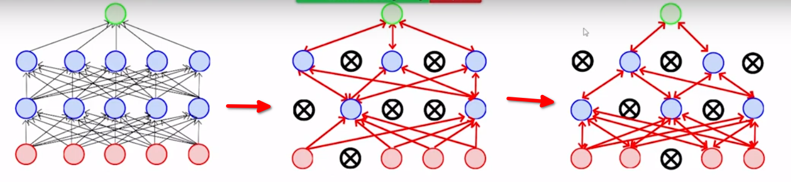

We can optionally weight the weights with the probability. 

Dropout prevents co-adopting.

Below is what regularization does

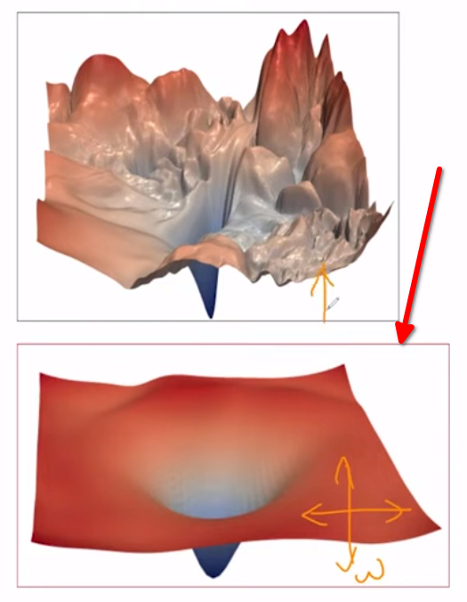

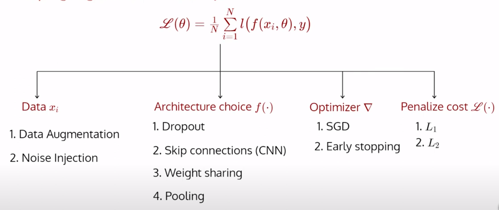

---

## Week 7

bro pre-training helps no matter the size of the network.

If we can capture the logic of n neurons in just m neurons then bueno :)

### Activation functions

#### Sigmoid

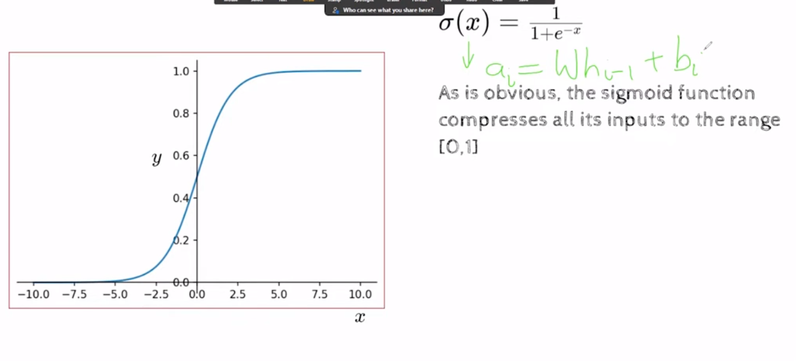

At large x values, the gradient vanishes. It is  also not 0 centered,it is 0.5 centered. So it does not allow negitive values which reduces the directions.

#### tanh

same but 0 centered. 

#### ReLU

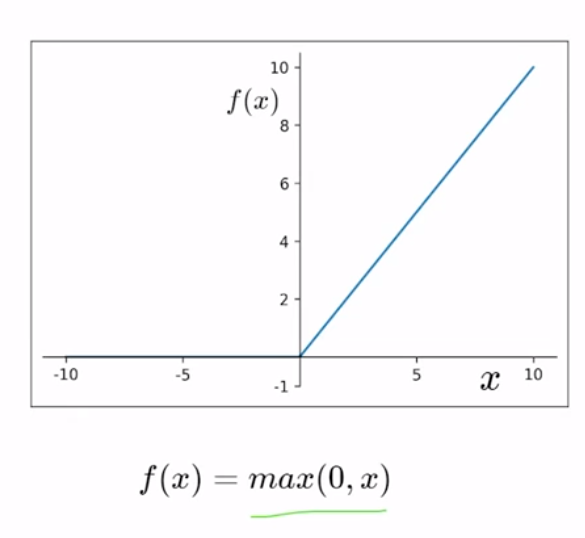

We can combine 2 relus o emulate sigmoid. This does not saturate in positive, very efficient but same direction issue. Also negative ignored is not the best idea. Can cause dead neurons.

#### Leaky ReLU

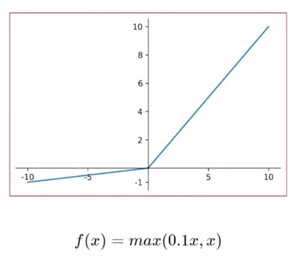

#### Exponential linear Unit (ReLU)

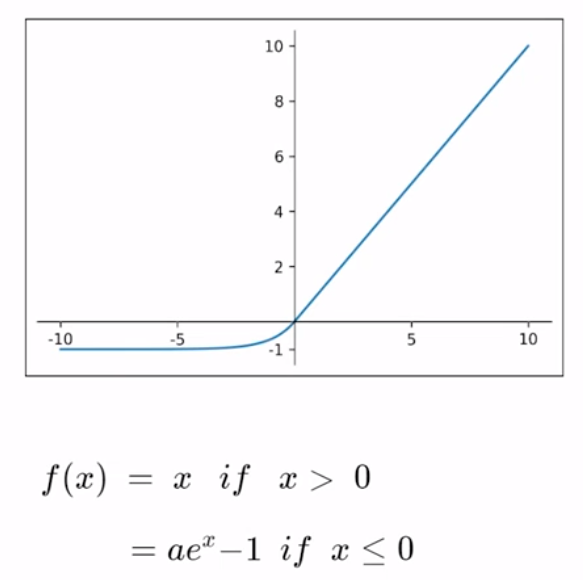

#### MaxOut

We take max of m neurons and keep only the max. 

#### GELU

Gaussian Error Linear Unit retarded formula.

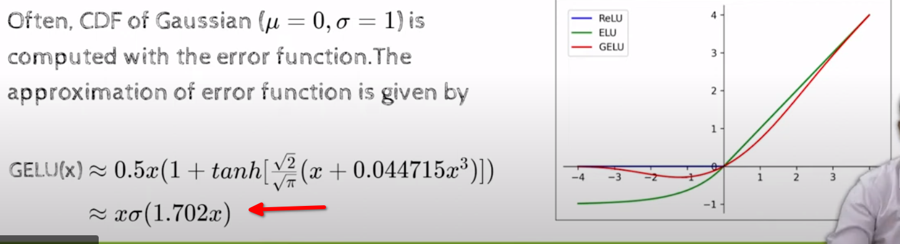

#### SeLU

Scaled Exponential Linear Unit. This tries to be 0 centered.

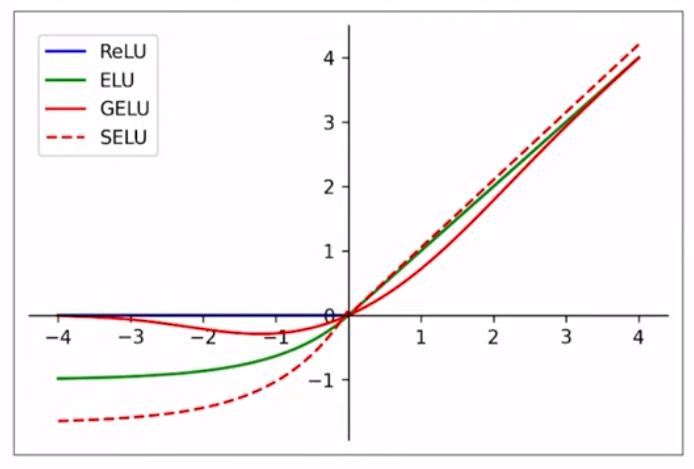

Eventually we settled on getting a chain of functions. SWISH is a type of GeLU.

---

## Week 8

Traditional convolution take all previous readings, in practice we keep a window. Weighted average of the neighbors for image.

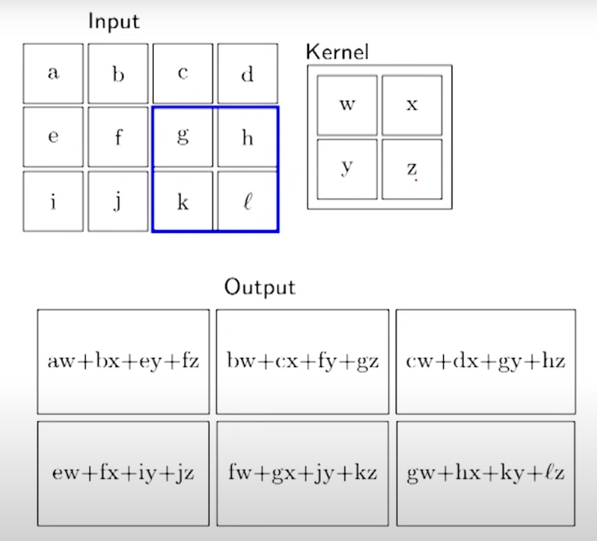

#### Relation between input output and filter size

kernel = filter

Width and height reduce by F - 1.

$W_2 = \frac{W_1 - F + 2P}S + 1$ 

"Depth" = Number of filters

The advantage of CNN is the  filter, a normal NN will take inputs from all the  pixels,  in CNN we can make it so that one neuron only takes that filters input. CNN has weight sharing cuz kernel is same. This causes very few weights so underfitting so we use multiple kernels.

We do input -> filter -> pooling -> filter ... -> Fully Connected Layer

Number of params = FxFxKxM (K is num of filters, M is depth of input)

Number of params in pooling is 0

Fully Connected layer:

HxWxD

from here on it is a regular network.

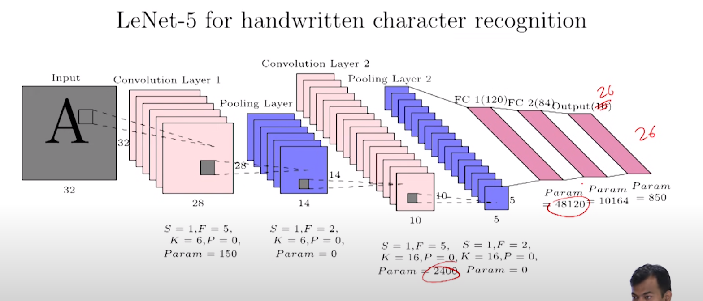

---

## Week 9

Some SVD stuff ignored.

continuous bag of words model

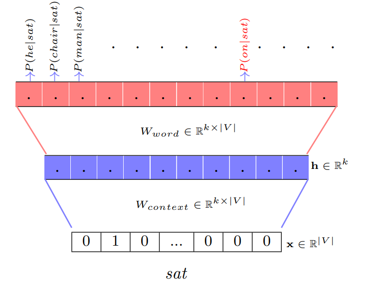

skip gram model

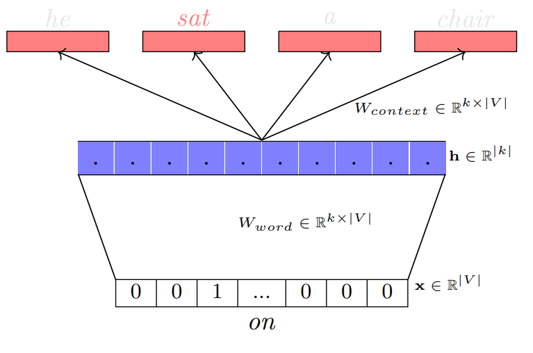

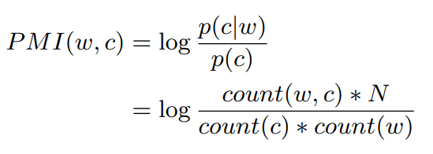
