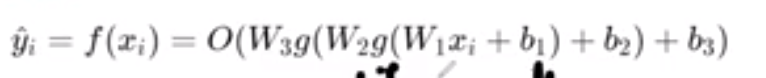

# Deep Learning

## Week 1

### History of deep learning:

Deep learning is inspired by the biology of the brain i.e. the network of neurons. This is translated to perceptrons in computer science. 

Jordan network was a RNN that introduced context to NLP and video processing.

:)

---

## Week 2

Linearly separable is essentially when one straight line can't divide the solution plane into the required sets. 

See above for XOR. This is to say that one perceptron can only handle a linearly separable data. We have $2^{2^n}$ boolean functions for n inputs.

A few terms to remember:

* $w$ is weight. This applied to an input.

* $h$ is usually the output from a perceptron.

* $b$ or $bias$ is usually added in the end , just before evaluation of a function.

So formula is usually: $w_0*i_0 + ... + b <condition> <some\ value>$ so for example: $w_0*i_0 + ... + b \ge 0$ If that is true then we have some output else some other output.

Input layer is not a perceptron. Hidden and output layers are perceptrons.

Things like sigmoid function help with non boolean implementations. So there are smooth transition between True and False.

This is usually applied to the final output. 

Full formula here is 

$output = \frac{1}{1+r^{-(w_1x+b_1)}}$ 

### Error:

Error is used to guide the algorithm.

Taylor series is a way of approximating a continuously differential function.

The higher the order of the function we consider the higher the "accuracy" will be.

This is gradient descent formula

Gradient is the collection of the partial derivatives. Matrix thingy. In gradient descent we move opposite to the gradient because that is where the loss reduces the most.

Let's say this is loss function. $f(x)$ is the prediction.

Change in weights is partial derivation (w and then b) of this.

$w_1 = w_0-\eta(\frac{df}{dw})$

REVISE THE BASIC INTEGRATION AND DERIVATION RULES!!!

We can approximate any function with $x$ number of towers.

We only need 2 neurons to make a tower, in 2d. and only 1 $x$. To get a "closed tower in 3d we use 4 neurons. 

Now if we add this to another sigmoid and set it so the all output above one stays the we get, .

---

## Week 3

Softmax is

$\frac{e^{aL_j}}{\sum_{i=1}^k{e^{aL_j}}}$

\>:( Softmax bounds to 0-1.

Cross entropy loss is $L(\theta) = -\sum_{c=1}^k{y_clog\ \^{y_c}}$

Now since we use this for probability, the formula simplifies into $l(\theta)= -log\ \^{y_l}$ where $l$ is the True class.

a is value pre-activation function and h is value post-activation function.

---
