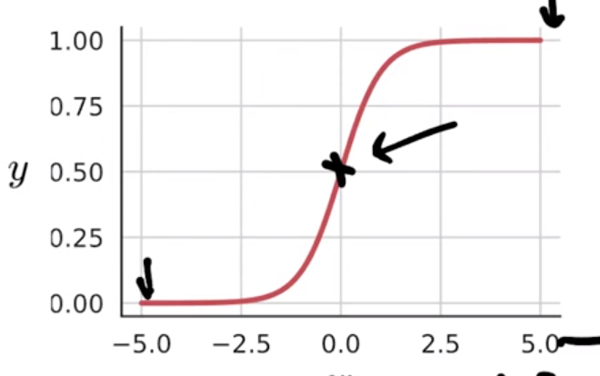

# Deep Learning

## Week 1

### History of deep learning:

Deep learning is inspired by the biology of the brain i.e. the network of neurons. This is translated to perceptrons in computer science. 

Jordan network was a RNN that introduced context to NLP and video processing.

:)

---

## Week 2

Linearly separable is essentially when one straight line can't divide the solution plane into the required sets. 

See above for XOR. This is to say that one perceptron can only handle a linearly separable data. We have $2^{2^n}$ boolean functions for n inputs.

A few terms to remember:

* $w$ is weight. This applied to an input.

* $h$ is usually the output from a perceptron.

* $b$ or $bias$ is usually added in the end , just before evaluation of a function.

So formula is usually: $w_0*i_0 + ... + b <condition> <some\ value>$ so for example: $w_0*i_0 + ... + b \ge 0$ If that is true then we have some output else some other output.

Input layer is not a perceptron. Hidden and output layers are perceptrons.

Things like sigmoid function help with non boolean implimentations. So there are smooth transition between True and False.

This is usually applied to the final output.
