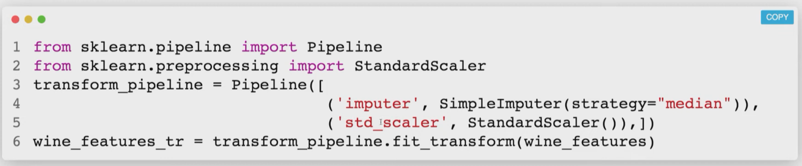
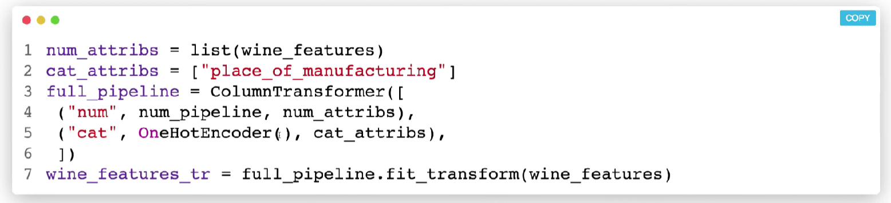

# Machine Learning Practice

8 steps in a ml project:

1. look at the big picture

2. get data

3. discover and visualize data to get insights

4. prepare data for ml algorithms

5. select a model and train

6. fine tune the model

7. present solution

8. launch maintain and monitor the system

Features are what we use to predict the label. 

## Data visualization

We use `.info()` on the pd to get a basic description of the dataframe. To get more statistics about the numeric data columns we use `.describe()`. 

We use `.value_counts()` to get count of values. This is both for numeric and non-numeric.

When we make a test set we might notice some patterns and choose a model accordingly. This is called **data snooping bias.**

We can set a seed while making a test and train set so that we can get the same split again.

`?<func>` shows basic doc of the func. 

## Data preparation

Stratified sampling makes sure that the train/test distribution is similar to the original dataset distribution.

Relationship between features is co-relation. This can be visualized using a heatmap. However a heatmap only shows the linear correlation. If it is non-linear then we use rank correlation.

Data preprocessing can have a few steps:

1. separating features and labels.

2. handling missing values and outliers

3. feature scaling to bring all features to same scale

4. applying transformation (log, square root etc)

We can fill or drop NaN or null values. We choose to use a median or mode etc based on the situation.

`.fit()`essentially readies the data for the model. It does the filling and all that after we call transform. We can also see that it calculates a median for each column (`.statistics_`). We also have to convert categorical alphanumeric data into numbers. We can do that using various encoders. Ordinal encoding essentially gives numbers to each category. On issue with this is that lot of models might assume that 2 values next to each other are closely linked. To circumvent this we use on hot encoding. Essentially binary. Embedding allows us to use ,on large categories set, one hot without huge numbers.

```python
from sklearn.impute import SimpleImputer
imputer = SimpleImputer(strategy="median")

imputer.fit(feature_set)
final = imputer.transform(feature_set)
```

Scaling is -_-. Min-max or normalization. Standardization is when we subtract mean value and divide by standard deviation. This ensures resulting feature has unit variation. It is not bound by  0 and 1 and i also less affected by outliers compared to normalization.

Pipeline is when w line up a set of transformations in an intended order. 



This can be enhanced to use categorical features as well.



## Select and train model

On the way to choose a model, we can run a basic model to understand where to proceed.

`.fit()` here is for training the model and `.predict` is for making predictions.

We can improve our model by running the model over multiple hyperparameters and choosing the best. This is done thru gridsearchcv. For a large hyperparmaeter space we can used randomizedeearchcv. We can also drop features now.

---

## scikitlearn

`.DESCR` gives lot of desc of the dataset. Za  most.

---

*Week 2*