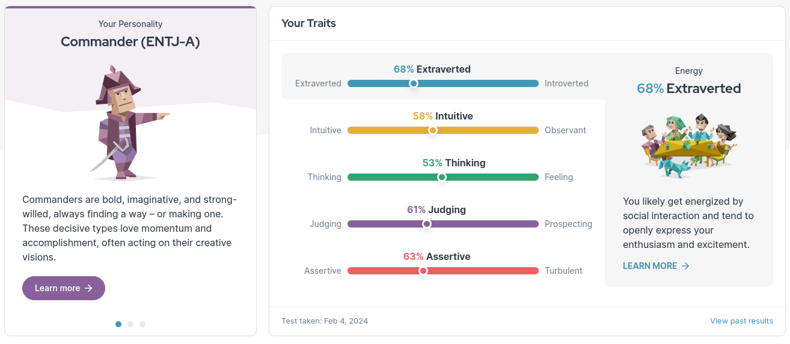

# Personality Results

Link to results: [Anirudha Anekal - Assertive Commander (ENTJ-A) | 16Personalities](https://www.16personalities.com/profiles/2fb5656987701)

Name: Anirudha Anekal

Roll Number: 21f1005685

Results:

The above is the results from the personality test. My personality is ENTJ-A Commander. These results are close to my personality in real life. I will explain a little more below followed by how it relates to my career prospects.

#### Extroverted

I am a little extroverted in real life. However I struggle a bit online. I've often hesitated from messaging people and sometimes back out completely. I have improved recently.

#### Intuitive

I disagree with this. I am not intuitive (as per the website's description). I am far more observant than intuitive.

#### Thinking

I agree with this. I feel like I have a balance of feeling to thinking. I can get heated sometimes but I in most cases I am extremely calm, sometimes to my own detriment.

#### Judging

I'd say I'm **very** "judging". By the definition it means I like organization and decisiveness. I'd say that I'm more 'judging'.

#### Assertive

I'd say this is accurate. I am assertive but every now and then I can try to be compromising. I am a little bit too assertive sometimes.

---

### My personality's effect on my career

I'm looking to go into 2 sectors in computer science. These being data science and gaming. I will explain further below. 

#### Data Science:

I feel that my personality and the way I think is very useful in data science. My assertive and thinking traits will help me when I need to understand exactly what results are required and my judging trait will help me set goals and expectations as per my abilities. Since this is science all these will help me navigate a data science career.

#### Gaming:

I feel my personality and traits will not help in this field. I am very interested to work on a game and have also done so in the past. However this is an art field. My traits do not lend well into the art field. My saving grace has been my extroverted trait which helped me do a little better when I was struggling. If I get into this field, I will likely be a core coder and not related to art. I have a passion for art but I feel I will not be able to work in arts.

---

## Conclusion:

My personality is not something I am embarrassed or proud of. I have traits that I'm proud of and traits I do not love. With my career in mind, my personality is a mixed bag. While it lends well to helping me work to my strengths, it hinders me when I pursue my interests.
