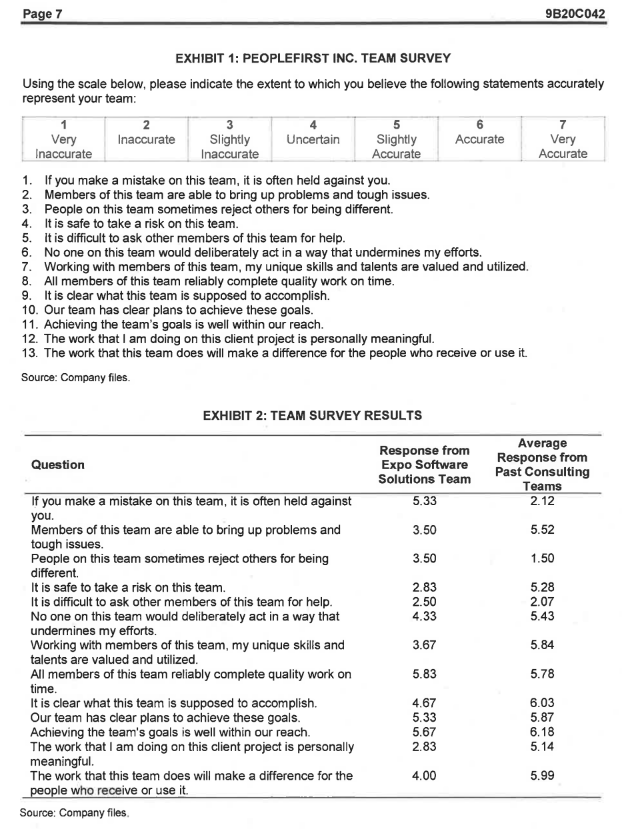

Renne Janseen -> Founder

Marcela Lopez -> good to bad

People first is for refocusing from short term to long term.

Expo new client and new stuff. Software is new.

Marcela was a bitch so Renne had a survey. psychological safety was most important.

Jigar agarwal was a good source. No comuunication and decitions without the team's consent. Lopez alos did everything. If someone was below Lopez's expectations the lopez would just do it herserlf.

Lopez just gave excuses. Alos involved charles. Legally bad. Still deflecting.

Charles said he was asked. He did not demand.

---

Week 9

Step 1: Download the file Growth Mindset Case Study Collection by NeuroLeadership Institute:

https://drive.google.com/file/d/1Z8-OLLsiobEI0fkkD-mD9-VFJOmMJDAo/view?usp=sharing

Step 2: Read the questions given below closely and analyze what they are requiring you to do:

Why did Telenor/ Microsoft/ Cigna/ Bristol-Myers Squibb (choose any one company) decide to create a culture of a growth mindset? How did the company create strategies for building everyday growth mindset habits for employees? What has been the impact of their journeys of building growth mindset cultures on the workforce to date? What are the key takeaways from this course module and any reflection or practice you should do to build on what you've learnt if you join any of these organizations?

Step 3: Like any essay, you will need an introduction, body sections (in which you answer the questions posed to you regarding the case study), and a conclusion along with three key takeaways from this module.

