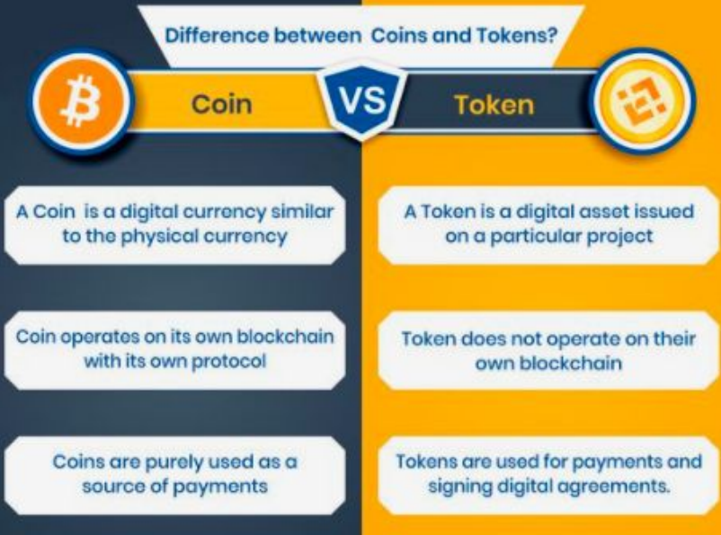
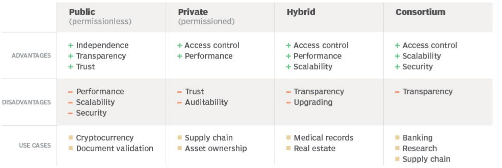

# Unit 1

# Index

- [What is blockchain?](#what-is-blockchain)
- [Public ledger](#public-ledger)
- [Node](#node)
- [Cryptocurrency](#cryptocurrency)
- [Token](#token)
- [Blocks](#blocks)
- [Transactions](#transactions)
- [Peer to Peer Network](#peer-to-peer-network)
- [Types of Blockchain](#types-of-blockchain)

### What is blockchain?

It is an “Open, Distributed ledger that can record transactions between 
two parties in a Verifiable and Permanent way” - Harvard for some reason in 2017

A transaction is executed AFTER a block is added.

A blockchain is:

+ Open

+ Distributed

+ Decentralised

+ Verifiable

+ Permanent

Advantages:

+ Anonymity

+ Immutability

+ Transparency

+ Peer to peer

+ Distributed 

+ Decentralised

### Public ledger

This is the local copy thing that all the nodes have. It is the actual blockchain. It is the decentralised thingy.

3 types of ledger based on amount of entries in the ledger.

|                  | Single Entry Ledger                                 | Double-Entry Ledger                                              | Triple-Entry Ledger                                                                     |
| ---------------- | --------------------------------------------------- | ---------------------------------------------------------------- | --------------------------------------------------------------------------------------- |
| Recording        | Each transaction is recorded once as a single entry | Each transaction is recorded twice as a debit and a credit entry | Each transaction is recorded as a debit, a credit, and a blockchain entry               |
| Complexity       | Simplest form of accounting                         | Widely used accounting method                                    | Extension of double-entry system with blockchain technology                             |
| Accuracy         | Limited accuracy and error detection                | Higher accuracy and error detection                              | Higher accuracy and error detection, enhanced by blockchain immutability                |
| Transparency     | Limited transparency and auditability               | Provides transparency and auditability                           | Provides transparency and auditability with independently verifiable blockchain entries |
| Fraud Prevention | Limited fraud prevention measures                   | Helps prevent fraud through duality of entries                   | Helps prevent fraud through duality of entries and immutable blockchain records         |
| Applications     | Personal or small-scale record-keeping              | Widely used in finance and accounting                            | Potential applications in supply chain management, financial transactions, etc.         |

## Main concepts in blockchain

+ Nodes

+ Cryptocurrency

+ Tokens

+ Blocks

+ Transactions

+ Public Ledger

+ Peer to peer Network

#### Node

All computers that are connected to the network

##### Types of nodes

##### Based on level of participation

###### Full node

Downloads all the blocks and transactions. It is fully independent, can provide blocks to other nodes and can also verify.

###### Lightweight node

Has the block headers and some transactions. This is the more regular ones. It has public/private key and uses SPV to verify transactions.

###### Miner node

This helps in making new blocks. In Bitcoin always done by a full node.

##### Based on type of blockchain

###### Public

Bitcoin, Ethereum

Open for all. Full, Light or miner allowed. 

###### Permissioned

Corda, Hyperledger, Fabric

This is usually only for known people. Full or light. Miner usually not used.

###### Federated

Factom, Waves

This is usually only for known people or organisations. Full or light. Miner usually not used.

#### Cryptocurrency

Here are a few currencies

| Name         | Something else                                                    |
| ------------ | ----------------------------------------------------------------- |
| Bitcoin Cash | Uses C++. Split into 2. Bitcoin cash and Bitcoin SV               |
| Monero       | Open source.                                                      |
| Dash         | Uses C++. A fork of the bitcoin protocol                          |
| Dogecoin     | Uses C++. Made as a joke. Then Elon did stupid shit.              |
| NEM          | Uses Java, C++ and Qt                                             |
| Nxt          | Uses Java. This uses proof of stake so no miners.                 |
| Peercoin     | Uses C++, Qt. It is proof of work and proof of stake.             |
| Primecoin    | Uses C++. Proof of work. It searches for prime numbers.           |
| Potcoin      | Aims to become standard for of payment for the cannabis industry. |

##### Advantages of Cryptocurrencies

+ Inflation

+ Self governed

+ Secure

+ Private

+ Easy to exchange currencies

+ Cost effective

+ Fast

##### Disadvantages

+ Illegal easy

+ Any loss in data can be a huge loss financially

+ Can be controlled by some organization

+ Mining is shite to the environment

+ Hacking

+ No refunds or cancelations. 

#### Token

Token is a digital asset. Programmable assets or access rights. It is used for Decentralised Applications and Autonomous Organisations. This is managed by a smart contract.

##### Types of tokens

+ Utility

+ Security

+ Governance

+ Transactional

+ Platform

+ NFTs

### Block

### Transactions

### Peer to Peer Network

This is discussed later. Apparently all peers maintain the complete copy of ledger????

### Types of Blockchain

Broadly there are 4 types. Private, Consortium, Public, Hybrid.

##### Public

Usual. The longest chain is the accepted chain. While you can mine on the shorter chains it is not recommended. 

##### Private

Usual.

##### Hybrid

Usual. Private do shit. Public verify.

##### Consortium

This is also called federated. This is the organization one.

