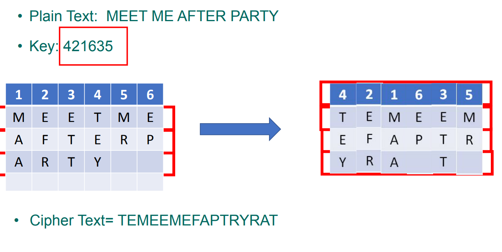
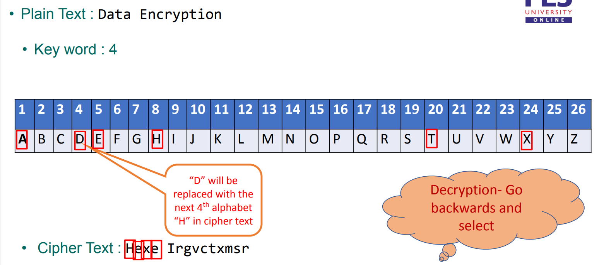
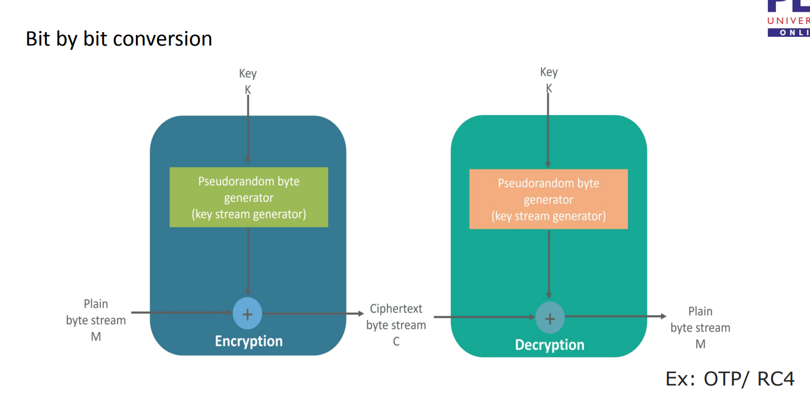
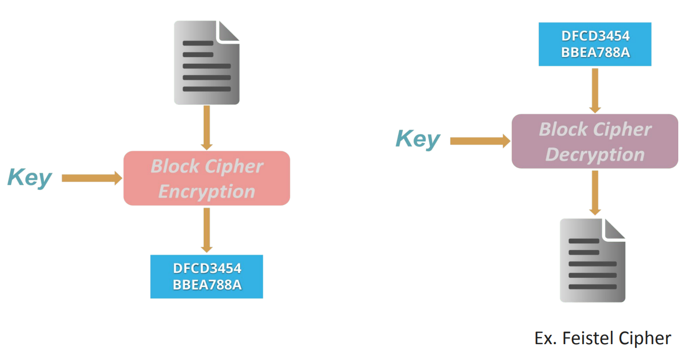
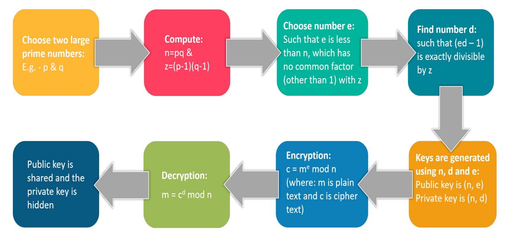
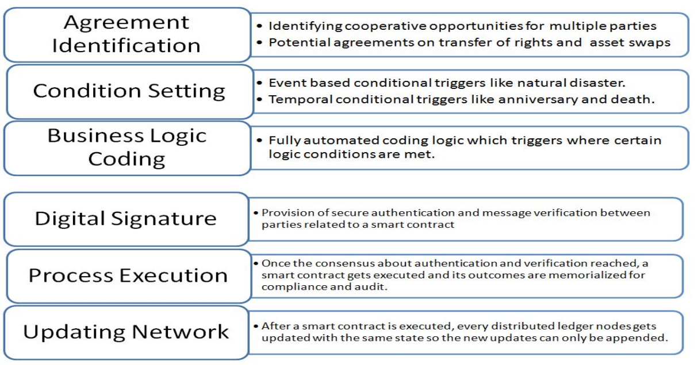
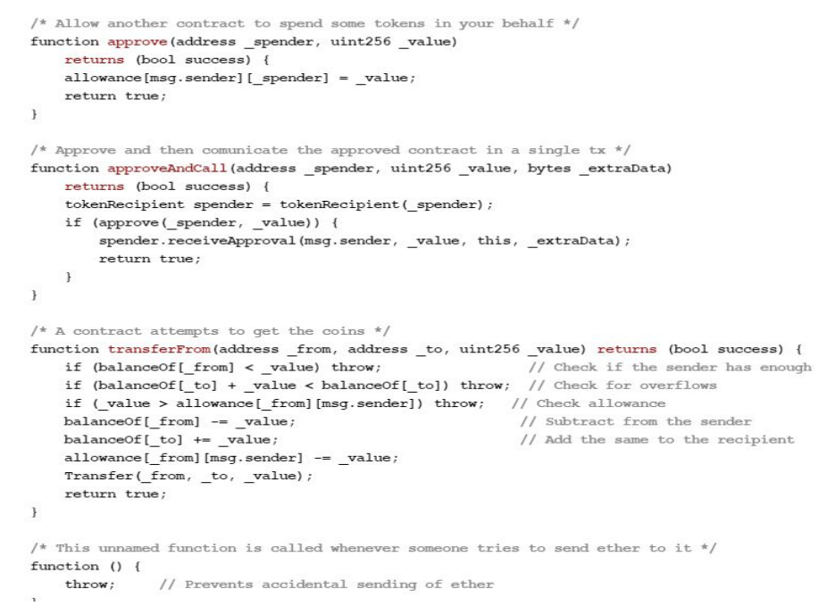

# Unit 2

## Index

+ [Symmetric Cipher](#symmetric-cipher)

+ [Asymmetric Cipher](#asymmetric-cipher)

+ [Digital Signature](#digital-signature)

+ [Hash](#hash)

+ [Consensus](#consensus)

### Cryptography

Why? To achieve the CIA triad i.e. Confidentiality, Integrity, Availability and Non - Repudiation. Non - repudiation is Sender of the information cannot deny at a later stage their intentions in the creation or transmission of the information.

2 basic types of ciphers. Symmetric and non symmetric.

##### Symmetric Cipher

Common problem is scaling. We need nC2 keys for n participants.

+ Transposition Cipher
  
  

+ Substitution Cipher

+ Stream Ciphers

+ Block Cipher

###### DES

This is a block cipher. A 64-bit key but effectively 56 bits. Not used as it weak as fuck.

#### Asymmetric Cipher

This is the private and public keys.

###### RSA

###### Diffie Hellman

dunno

#### Digital Signature

This is a digital fingerprint. They use the standard Public Key Infrastructure. We add the digital signature to the file after encryption. This does all the CIA and non repudiation.

#### Hash

The usual. MD-5, SHA-1, SHA-256 (bitcoin), Keccak-256 (Ethereum).

## Consensus

## Smart Contracts

A smart contract is a self-executing contract with the terms of the agreement between buyer and seller being directly written into lines of code.

Advantages of using a smart contract

+ Autonamity

+ Trust

+ Security

+ Backup

+ Safety

+ Speed

+ Saving

A smart contract is made out of

This is a contract written in solidity

This notes is small cuz unit 2 is stupid stuff lol
