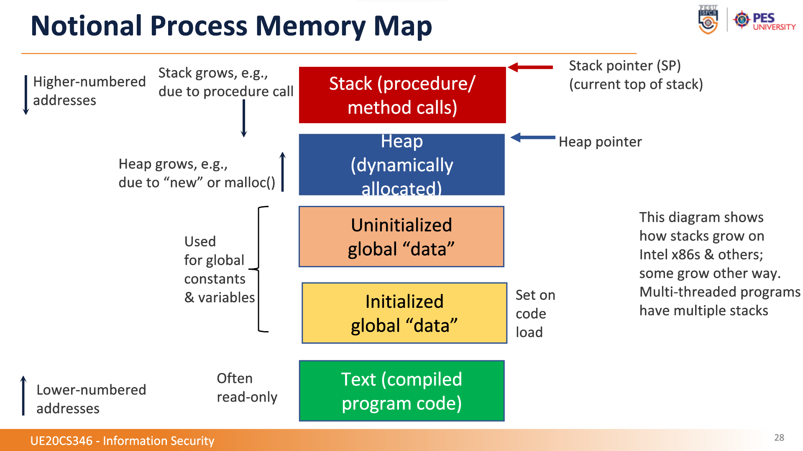

# Unit 2

## INDEX

---

Buffer Overflow

Stack smashing and heap smashing ie overflow/ overrrun.

In c \0 represents the end of string. if we ovewrite this then itll be like the string never ends. \0 is called NUL or NIL NOT NULL.

Stack pointer points to the top of the actual stack. This is changed during push/ pop.

Frame pointer points to where the procedure is starting. This is changed during entry and exit of func.

All local made variables are in stack. Including the parameters and the malloc ones. The actual malloc memory is in heap.

Uninitialized static vars go to BSS. Global vars in data segment.

This is stack frame. top ig is stack pointer.

strcpy(dest,source)

NOP - no op. We use this to fill up space. It tell go to next line. So when we override the return if we pad the malicious code with nop, we can take a much easier guess in the return. 0x90. 

Badfile should not have a '0' otherwise strcpy will stop.

Countermeasures: non executable stack (this is hardware + BIOS dependent), analysis, code lang, dlls, better code, addr randomisation.

TO beat adr randomisation we just brute force. Stack gaurd will prevent this and trigger a "Crash"

---

#### Return to libc

This is to beat non executable stack. Here rather than running from stack we return to a library instead.

libc is a common lib that a lot of progs use. We will exploit the system() func in it to access root shell. We will override the return address with the address to system func.

We need a env var that has "bin/sh/" so that we can pass that into the system() func. We will place this var's addr and the return addr into the stack.

this will be the badfile

---

#### Format String Vulnerabilities

printf(<concrete arg> , <zero or more optional args>)

The optional args is the problem. If we mess around and give it less than req it will just keep chugging along and start taking other things from the stack. va_list is the list of var's locs

5 attacks:

* crash: here is the above one until comp freaks out.

* print out details in the stack: here we will pass %<something> to make the prog print the req datatype in the stack.

* change the programs memory: %n will write the number of chars printed till that point. it store it in the mem loc that va_list provides.

* change the mem to a specific value: same like above only we use %.<number>x%n. This is like %.100000x%n. So if 20 chars have been printed then 100020 will be made to hex and stored.

* inject malicious code: here we will rewrite the return function to point to the malicious code.

Stack gaurd and non executable stack are not useful here. first one we target the addr to change and second one we beat by return to libc.
