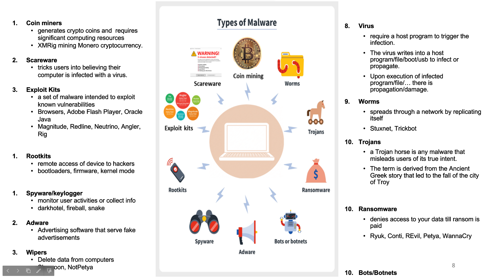

# Unit 3

## Malware

Attack kit is a toolbox.

APT: Advanced persistent threat

#### Worm

morris worm is the first significant one. Email. tries to crack local password file.

Clickjacking is where we make the victim type or click on a thing they dont see or dont intend to.

antivirus generations.

conflicker worm used a windows buffer overflow exploit. it removed auto update and messed with the dns of anti virus websites.

STUXNET was not designed for windows, for SCADA -> factory software. this hit a nuclear reactor. It spread using windows tho. 3 things a printer vul, remote code and disk media shell vul.

WannaCry

---

Threat modelling

way to find security issues.
• Think about security issues early 
• Understand your requirements better 
• Don’t write bugs into the code

trust boundary is where entities with different privilages interact.
