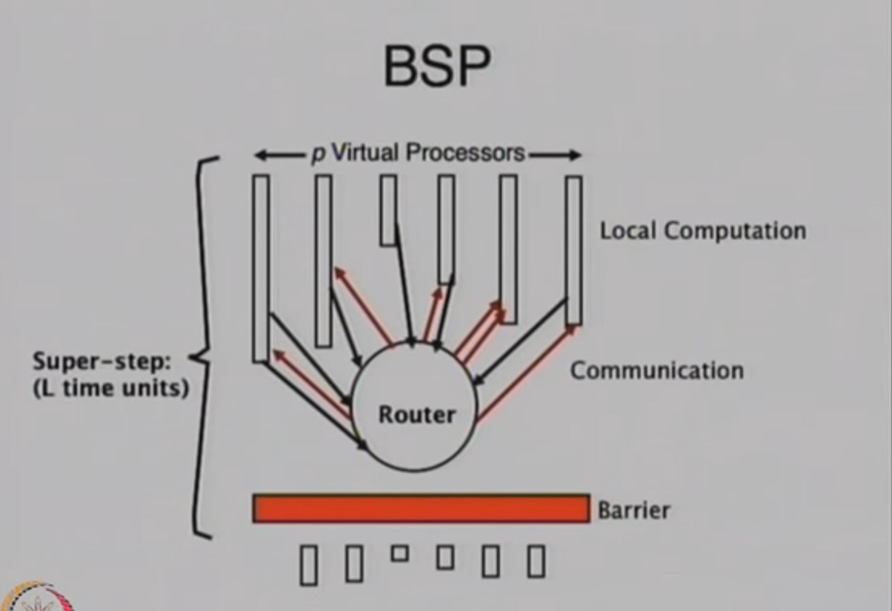
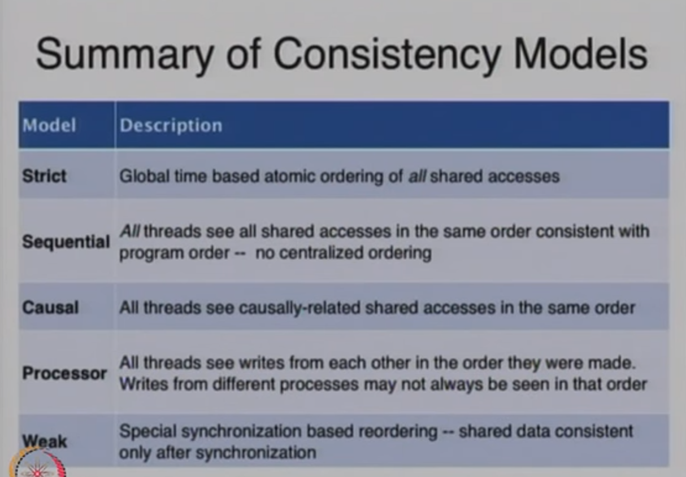
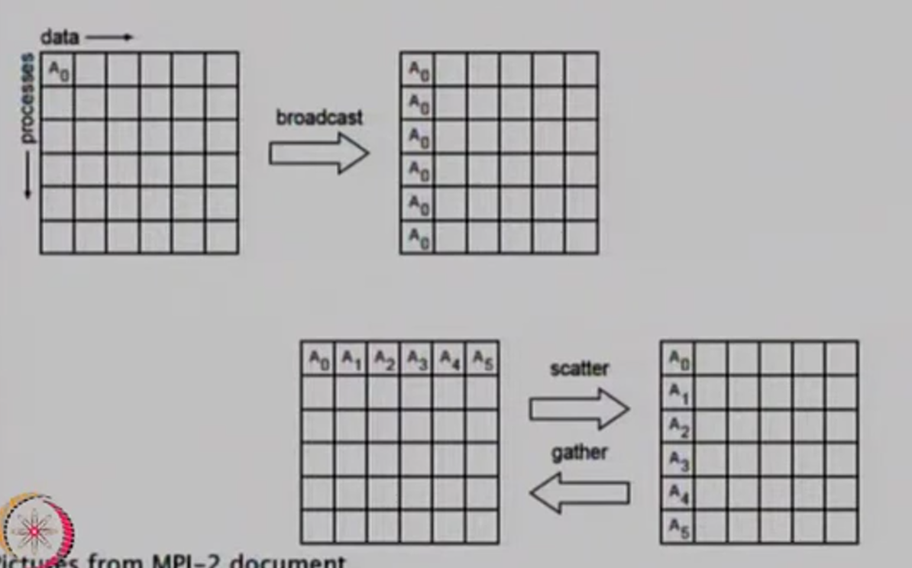
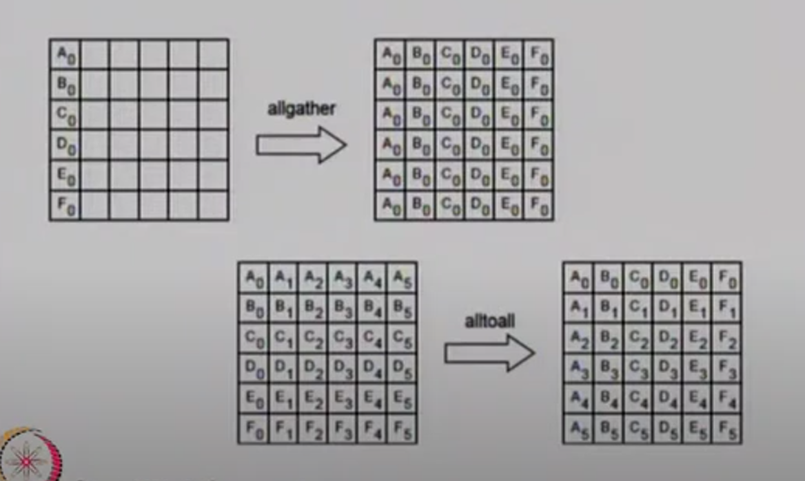
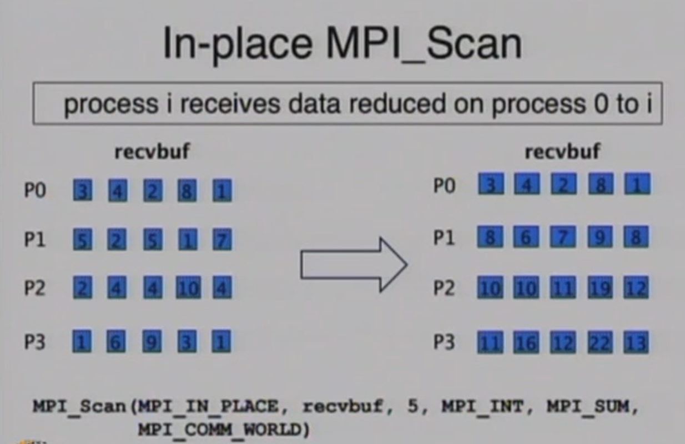
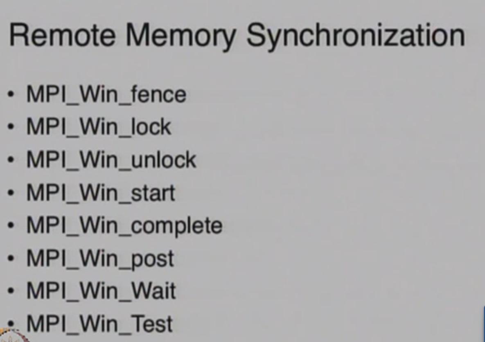
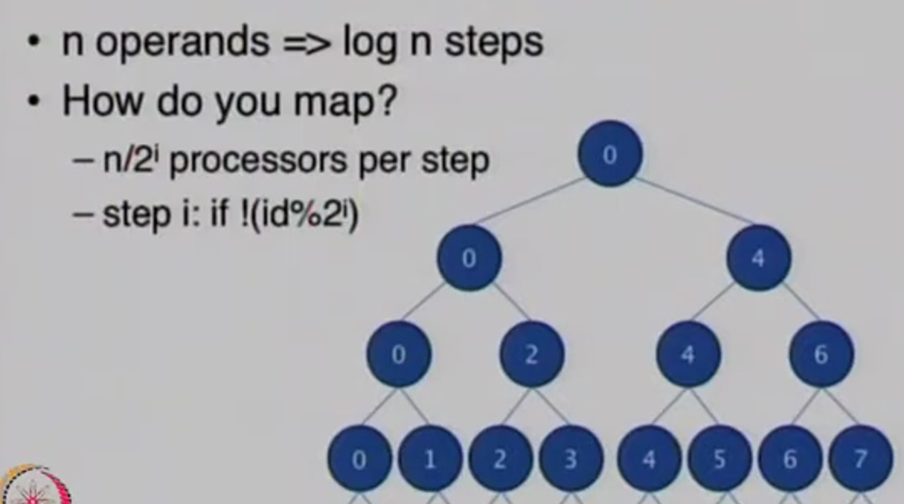
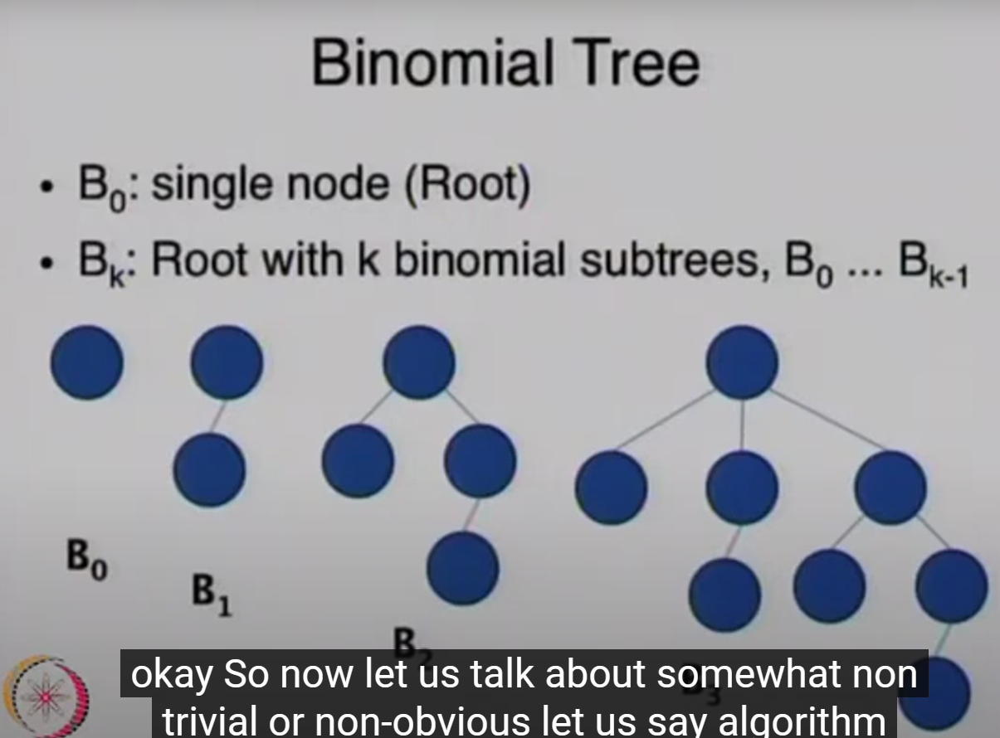
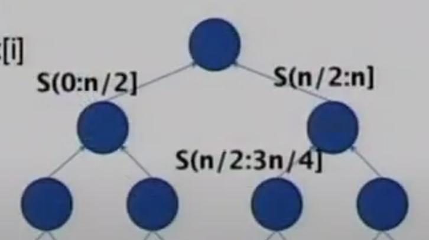
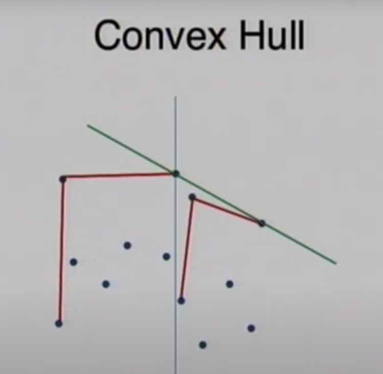

# Unit 2

###### lec 10-20

PRAm is gud cuz its easy to design algorithms, analyse.

## Work Time Scheduling Principle

This essentially says do not care about the actual number of processors present. Make a algorithm that evaluates in t(n) steps using p processors and let a auto scheduler manage the algorithm in the bare metal.

Cost optimal algorithm is automatically work optimal (this is compared to sequential).

### Bulk Synchronous Parallel Model

This says that there are virtual pairs of processor and memory. There is not local mapping but instead network memory. It operates by executing "super step":

- local computation

- communication

- barrier synchronization

BSP has system wide steps, like pram. It is simple to analyze. It connects well to physical architecture. 

Calculating cost for this is a little more complex. 

- barrier cost of l (barrier sync)

- superstep cost: local computation + communication + barrier ==> $w+hg+l$  g is thruput, h is message something

- $Total/ cost = \sum w_s + g \sum h_s + Sl$

### LogP Model

btw this isn't math log. This is l,g,p from above. wat is o? no-one knows.

 

Let's say we are doing a regular search. N elements and p processors. This will be technically faster than regular binary search **but** WORK DONE is way higher. 

---

## Memory Consistency

### Cache Coherency

This is L1 cache of a thread making sure to write to L2, or whatever is the shared memory, to maintain that data's "freshness" or coherency. This makes sure that all threads work with proper updated data. 

Snoopy cache coherence protocol is literally wiretapping. 

### Strict Consistency

- read(x) must return the latest write(x). It should also appear as if operations are instantaneous.

- linearizability is a weaker version. It has a point for sync called linearization point. It is instantaneous here.

- Impractical: wth is this? It said it is done for uniuser, so its just nothing happening? o_o

### Sequentially Consistent Model

This is where the memory is consistent to how the memory would have been if the program was sequential. This is hard to implement. 

### Processor Consistency

All processes must see memory writes from one process in the order they were issues. This is FIFO consistency. Processor consistency is when we say all processes see memory writes to a variable (data)  must be seen in the order of issue. 

### Weak Consistency

Consistency is only enforced on request. OpenMP uses this.

## Performance issues

- True sharing:
  
  - make copies for each processor

- False sharing
  
  - give continuous blocks💀. These blocks have the variables. In this we send lines of memory. So we get some useless stuff. 

There are other things like make code short, use as many threads as required etc.

---

## Message Passing Interface (MPI):

This is just what the heading is. No magic nonsense. Also the low level implementation is left out.

There is synchronous or asynchronous implementations. 

In async we are using buffers and stuff to CHECK sync. Sync enforces the CHECK between sender and receiver. 

- Standard mode: This will chose from the following modes dynamically.

- Buffered mode: I dunno. User specifies the buffer.

- Synchronous mode: Will complete once receive operation is accepted. We can send stuff without waiting for a corresponding receive.

- Ready mode: Sending waits for a receive. This is like standard but with an optimization

Messages are:

- in-order

- have progress (send or receive will complete)

- not fairness guaranteed (receive can be a open to all or open to one)

- resource limited, sync are usually more resource efficient

They have data in a special format, `MPI_INT`, `MPI_CHAR` ... etc as well as user defined one like `MPI_<whatever>` and we can make `MPI_VECTOR` which is like blocks of data.

For user defined types we have to "commit" the datatype, after creating the type, before we use it in communications. This is an OpenMPI specific thing. Other don't use "commits".

There are also a few different types of "collective" or group communications.

1. MPI_Barrier: This is like a message that causes a sync. It pauses threads until all (or the required threads) of them have sent this message. Imagine like waiting for your entire team to finish the lap before all of you can go to the next lap. This only returns after everyone calls Barrier.

2. MPI_BCast: One message to all. Broadcast. This returns after YOU receive the message. No guarantee of the others receive. Broadcast has to have previously chosen sender and receiver, and both make a call to send and receive. It is not interrupt based. A broadcast happens to a communicator (basically a yt channel). A blocking broadcast REQUIRES everyone to read before other broadcasts.

3. MPI_Scatter: One unique piece of the message to each one. 

4. MPI_Gather: Get all parts from a group.

5. MPI_Alltoall: All Send, All Gather.

6. MPI_Reduce: This is reduce from the threads sync i.e. take all results and compile according to the requirement. |||ly MPI_Reduce_Scatter.

7. MPI_Scan: Not what it seems. Get all values before you, process it and do something ig. Kinda wierd tbh. Google for clarity or more pain.

We can "spawn" threads with `MPI_Comm_Spawn`. Window is like a chuck of memory I suppose. Use `MPI_Put` and `MPI_Get` to work with it. There are so many other ones man. 

---

## Algorithm Techniques

#### Balanced tree approach:

We build a binary tree on the input, thereby dividing into hierarchical groups. Travel the tree.

The numbers are the processor numbers. This is reduction.

Each processor is dependent on itself in a binomial tree manner.

Prefix sum is sum of everything before it. $x_{n} = \sum_{0}^{n}{x_i}$. Below is prefix sum. $S(m:n]$ means sum of mth element to n-1th element.

---

#### Partitioning

Merge sort: This is kinda the direct obvious implementation. Merge sort has 2 things that need to compute and combine, so compute those together ╮(╯-╰)╭. HOWEVER this isn't the best parallel merge sort.

Optimal merge sort has gone over my head. Here are some key words. Split the main list into loglogn size chunks and do the merging. Complexity is $O(n*log(log\ n))$. ~~How? black magic.~~ This is an example of accelerated cascading. Explained lil later. (We have taken 2 diff algos to determine that loglog n size)

Convex hull is parallelized by "splitting" the set of points. We make basic hulls for both sets of points and combine. 

---

#### Accelerated cascading:

This is where we take a fast but not optimal algorithm and combine with an optimal but fast algorithm to determine the optimal chunk sizes.

##### Minimum number finding:

This is optimized by making a binary tree with children of nodes = $\sqrt{\#nodes\ in\ tree\ rooted\ at\ the\ node's\ prev\ lvl}$, depth = $loglog\ n$. Root has 9 children, next lvl has 3 children and so on.

---

#### Recursive doubling:

Don't know.