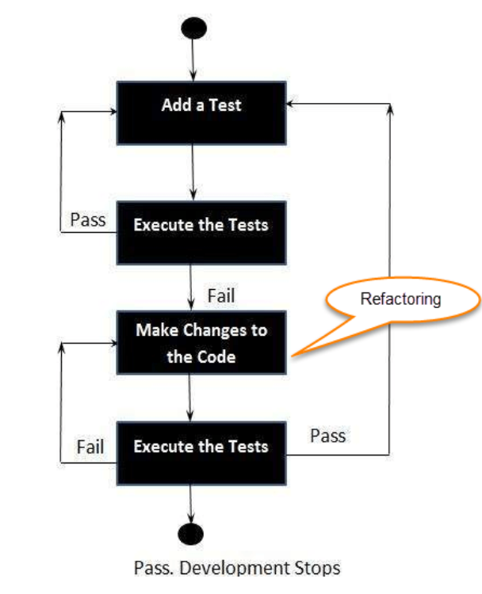
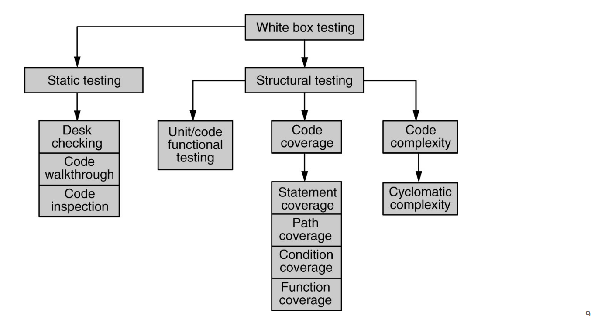

# Unit 2

## Unit Testing

This is where we test individual components. Usually done during development by the developers. Some tools are NUnit, JUnit, JMockit. Automated ones are EMMA (for java) and PHPUnit. `assert` is a commonly used across languages for unit testing. 

While unit testing is very powerful it cannot catch all errors and cannot evaluate all execution paths.

---

## Test Driven Development

This is where we design and create tests for each application function and developers only writes new code when the automated test cases fail. This promotes reusing and minimizing code, while prioritizing requirements. It also allows easier documentation.

---

## Refactoring

This is the process of changing a software system without altering external behavior while improving architecture. This helps minimise code thrashing. This is where 2 developers introduce conflicting changes.

---

## White Box Testing

Static Testing is only done on the code and not on the executable.

Desk checking is done by the author. Code walkthrough is done as a group or by another person. Code inspection or fagan inspection is **group oriented** and formal.

Code inspection has a few roles. Author, moderator, inspectors, scribe. This generates a few documents.

Linting is static testing. These are generally the various warnings we see.

---

## Structural Testing

This is done by running the executable. This has test cases n stuff. Unit, code coverage, code complexity testing come under this.

### Code coverage testing:

The focus is to cover all the code and map all parts of the code to required functionality. Statement, path, condition, function coverage are different types.

$$
Coverage = \frac{StatementsExecuted}{TotalStatements} * 100
$$

Most tools for this are extremely language dependent.

Path coverage is most "stronger" than statement coverage as path coverage deals with logic not just statement executions.

Condition coverage makes sure that every possible condition in every boolean statement is checked.

Function coverage checks if every function is covered by the test cases. This links the RTM. 

### Code complexity testing

This is where we analyze the code and test cases as well. Like independent paths, redundant tests etc. Cyclomatic complexity is used here. 

It measures the number of linearly independent paths in a module. The program can be made into a flow graph not flowchart (circles not wierd shapes).

$$
Cyclometric Complexity = E-N+2
\\Where: E = edges
\\N = nodes
$$

Generally a complexity above 40 is just impossible code. We should aim for 0-15. This does not measure any data complexity.

---

## Integration Testing

Stub are scaffolding. Drivers are the various softwares used to test.

Ways to integrate: Top down and bottom up and bi-directional and system.

Top down employs stubs but ensures that the high level logic is tested early on.

Bottom up employs drivers but allow early testing of utility modules.

Bidirectional is the best and worst of both.

---

## Scenario Testing and System Integration

Scenario testing is where we make stories and test in those scenarios. Usually mimicking a end user's experience. We use a traceability matrix here.

System integration is -_- 

---

## System Testing

Test full lol. Usually focuses a little more on non functional stuff like performance, cuz functional should have been tested before. Also tests functional tho just little less emphasis. We should check everything here. Load, stress, localization, interoperability, scalability, reliability etc. Design, archi verification.

Load testing is testing under normal situations.

Stress testing is testing under abnormal conditions.

Besides these we also do a few non programmatic tests like business vertical testing.

---