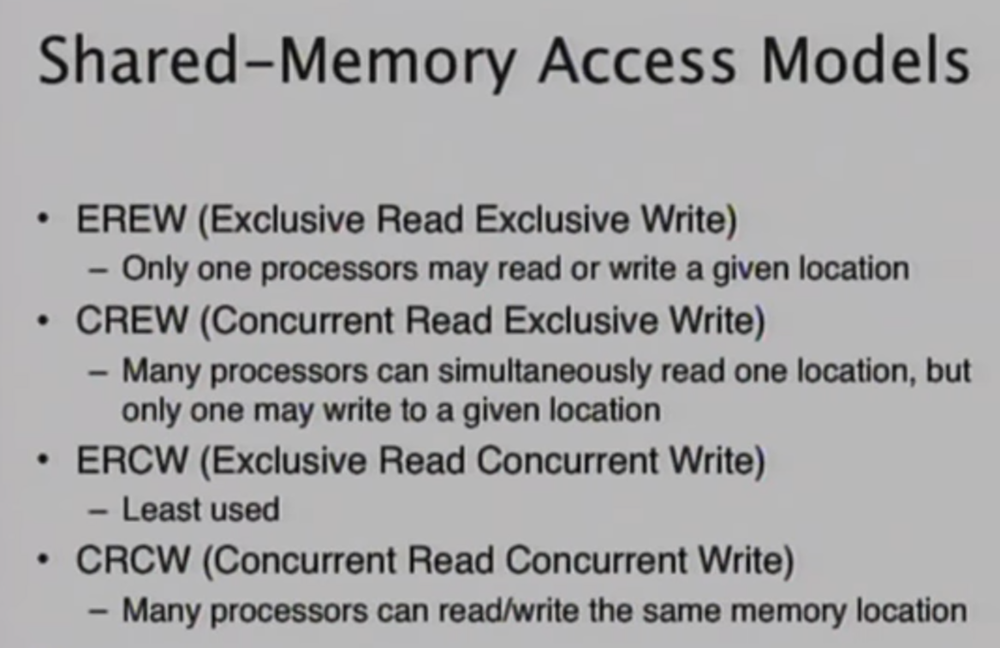

# Unit 1

###### (lec 1 - 9)

Parallel computing has arisen because of the hard limit of speeding up chips. 

There are 2 general ways of 2 threads or processes communicating with each other. Either a shared memory or message passing (there are other types). Nowadays it is a mix of both.

A few things to follow while programming with parallel concepts:

- Understand the model: The restrictions on the features of the application etc.

- Design accordingly. This is in terms of both theoretical model as well as the bare metal model.

- Treat each thread as an enemy of another. This is cuz we should know how to chose one thread over another.

- Set standards for communication and memory sharing.

- Employ high level constructs like letting certain libraries/ compiler etc handle a few parts of your code. This is to ease debugging.

---

## Shared Memory Architecture

Processes access the same global memory. This is divided into 2. Uniform Memory Architecture (UMA) and Non Uniform Memory Architecture (NUMA). NUMA is a way to give priority to cores that are closer to memory chips. Essentially each core has its own "local" memory it is responsible for.

| Advantages           | Disadvantages                                              |
|:-------------------- | ---------------------------------------------------------- |
| Easier to program    | Harder to scale (adding CPUs increases traffic)            |
| Faster memory access | Programmer initiated memory access. (hard to sync i guess) |

---

## Distributed Memory Architecture

Processors have only localized memory. They can access other core's memories through a robust communication network. Sync is programmer defined.

| Advantages                        | Disadvantages                             |
| --------------------------------- | ----------------------------------------- |
| Memory is easier to scale         | Programs are more complex                 |
| Local access is faster (no cache) | Data communication is not easy to manage. |
| Cheap                             |                                           |

---

## Parallel Computing models

There are a few models. Shared memory, message passing, threads,

### Shared Memory:

We will use locks and semaphores. Data can be cached locally.

### Message Passing:

Nothing new. (see distributed mem)

### Threads:

Independent processes with both local and shared data. Usually a mix of memory and shared.

### Data parallel:

Only one program is written but it is run parallely on different sets of data.

### Task Parallel:

This is basically threads but is the knuckles to data parallel's sonic.

### Pipeline:

This is like a chain (think chain of responsibility). Each processor passes data after some operation.

$$
speedup_n = \frac{one\_processor\_time}{n\_processor\_time(Time_n)}
\\
\\
efficiency = \frac{S_n}{n}\\
cost = n*Time_n
$$

---

## Amdahl's Law

$$
f = fraction\ of\ the\ problem\ that\ is\ sequential\\
1-f= amount\ of\ code\ that\ is\ parallelizable\\
p = number\ of\ processors\\
Best\ time : T_p=T_1(f+\frac{1-f}{p})\\
Speedup: S_p = \frac{1}{f+\frac{1-f}{p}}
$$

This is a way to see the maximum speedup paralellization can bring.

---

### Flynn's Taxonomy

This is a basic way to categorize parallel architectures. MISD (Multiple Instruction Single Data) is kinda "hidden" and not very common. SIMD is pipeline (i think). SIMD is cheaper and more power efficient and smaller. SIMD should preferably be condition free.

### Interconnect

2 basic network types: direct networks and indirect. Direct is when we have direct processor to processor. Indirect will have a switch or something in between.

The connections can be made using buses. This can be in any form. Direct circuit lines or even ethernet. 

Another way is crossbars. This mess below.


Usually it is a mix of crossbar and bus. 

---

## History

One of the earliest supercomputers used a crossbar/ mesh. Torus connections is the donut shape(circle). Hypercube is 3D mesh. Some other network style is a tree. FAT tree is when higher nodes have higher number of wires or higher bandwidth. So root node has fat thangs. Butterfly is this nonsense.


Essentially its a bit swap thing. First set is first bit swap and so on. So make groups and swap.

- Cray is an old processor manufacturer. It was 80MHz and \$9 million. 0_0. Nowadays 3GHz is available for \$300

- CM-2, 5 ...this was a harward group. They push SIMD. 

- NCube was a hypercube processor.

- Maspar used a crossbar.

- Roadrunner was the 2008's best supercomputer? Its in petaflops now. (not petaHz). This was one of the last non cluster type. This is using a cell processor (from ibm). This is the piece of shit that the ps3 uses.

- 
  
  WTH is this? A crap architecture that didn't catch on. IBM can suck it.

- Nvidia made a GPU called Tesla in 2000 something 2008 i guess. These are REALLY OLD NOW (2023). Fermi came out in 2010.
  
  

Oh hey good architecture appeared! 

---

## OpenMP

This is compiler supported, it is not a library, more like a model for compilers. We can give the compiler a heads up by typing `#pragma omp parallel <num of threads> {<code here>}`. If we don't specify number of threads then it will default to max supported by the cpu. Nesting threads are turned off by default but you can manually turn it on. Execution is done by making forks from the master code. the master code/thread then waits for all the threads to execute and then proceeds.

Variables declared outside the threads are **shared**. We can set "global" variables to be private to a certain thread as well, essentially making a copy for the thread.  

`Flush` is synchronizing values or data from thread specific memory to main memory.


Here in thread 1 the compiler might assume that since b is not used in thread 1 it might move it to a later line.


Flush ,assuming the compiler understands Flush, ensures that the compiler can't reorder.

These are different parameters that we can define for the parallel code. `reduction` is how we should compile the results from the threads. We can add, subtract or other operations. Remember that threads != number of cores (includeing hyperthreading) We can often run a lot more threads than the number of cores (5x +). `firstprivate` gets the value of those variables from global scope(CHECK THIS). `copyin` confused the professor so I'm not gonna try checking it.


This is a wierd one. All the threads are essentially doing the same task. If ith thread evaluated to true(ie it finished) , then ALL threads from i to N-1 **will evaluate to true.** This is what lastprivate does.

```c
#pragma omp parallel for
for(i=o;i<N;++i)
{
//prallel code here
}
```

This is also a valid way to writing. Here N is number of tasks not threads or cores. `nowait` makes it so that when a thread finishes execution, rather than waiting for the other threads to finish, it continues to the next task. 

`schedule` is a way to assign the division of tasks. 3 options. 

- static is 1st chunk to thread 1, 2nd to thread 2 .... 

- dynamic lets us define chunk size. 

- guided is dynamic but chunk size can also be dynamically changed for each thread. 

### Section

This is a way to write code that tells compiler to run some code o some thread/core. This is a bit of syntactical sugar.


master is just saying only master thread will execute this part of the code.

### Synchronization


This is called critical section. This basically puts a lock on accessBankBalance. So only one thread can execute. accessBankBalance is a name for a region. We cannot nest critical sections inside a section of the same name <== check this. 

**I DO NOT KNOW WTH ORDERED IS BESIDES NORMAL SEQUENTIAL CODING. IT JUST MAKES THE THREAD START ORDERED FIRST????? PLS CHECK.**

Flush is also considered a synchronization directive.

Another simple synchronization directive is basic locking. It is called thru `opm_lock_t` type variable. 

<br>

Inside work-sharing, critical, ordered, master we should not have another

- work-sharing section

- barrier

Inside work-sharing section we shouldn't have a:

- master section

Inside a critical region we shouldn't have a:

- ordered region.

### Example of parallel implementations:


You can make it even further if you'd like.

---

## PRAM Model


Parallel Random Access Machine (PRAM). It is a synchronous model. In each time unit every p can do one of:

- read from a memory unit

- perform a computation step

- write to a memory unit

Remember that co-access might be restricted. Each instruction generally takes O(1) time.



Concurrent write has a few ways to resolve a clash. Priority, random or common(this is when all values are same).  


Right can emulate left. 

*Some things omitted from notes cuz it felt meaningless/ useless. check lec 9 if you wanna see ehat is left out.*

Any problem solved on a p-processor PRAM in t steps, is solved on a p'-processor PRAM in $t' = O(\frac{t*p}{p'})$ steps assuming that the size of shared memory is same.

Similarly the same if we change memory cells. 