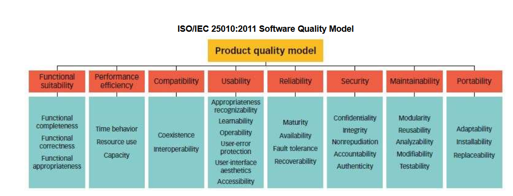
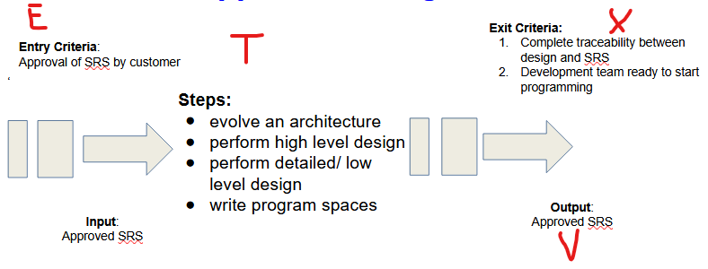

# Unit 1

**Software testing** is the activity to detect and identify the defects in the software.

**Software Quality** is a field of study that describes the desirable attributes of software products.

These are different software quality parameters:

* Bug Free

* On time delivery

* Staying within budget

* Meeting requirements

* Maintainability

### Software Quality Model:

* Functional suitability

* Reliability

* Operability

* Performance efficiency

* Security

* Compatibility

* Maintainability

* Transferability

### Software quality-in-use model:

* Effectiveness

* Efficiency

* Satisfaction

* Safety

* Usability

Deming's PDCA cycle: Plan, Do, Check, Act. Quality is often measured in MTTF (Mean Time To Fail). MTBF is mean time between failure. 

QA (Quality Assurance) is process oriented. QC (Quality Control) is product oriented. The cost of quality of a project should be around 3-5%. 

Cost for quality can have a few different forms. 

* Prevention cost

* Appraisal Cost

* Internal Failure cost

* External failure cost

<u>Error</u>: Human mistake

<u>Bug</u>: Deviation from expected behavior

<u>Failure</u>: Deviation identified by end user

Spiral model is the version release one. RAD (Rapid Application Development) is where we divide the project into small modules and a team is assigned to each one.

---

#### Static Testing

##### Review:

We check if documents are correct and complete.

##### Walkthrough:

This is an informal review.

##### Inspection:

This is the most formal review. Usually 3-8 people will be present for this.

##### Verification:

This is checking if we are making the right product.

---

#### Dynamic Testing

Validation: This is where we make sure we are making the product correctly.

---

### Levels of Testing

#### Unit Testing:

This is where we test one unit or module. A few techniques are:

- Path testing

- Control Structure Testing

- Conditional Coverage

- Loops Coverage

- Mutation Testing

#### Integration Testing:

This is done on 2 or more modules. It is focused on the communication between the modules. It is white box testing,

#### System Testing:

This is testing the entire system working. It is generally black box testing.It generally is:

- UI testing

- Functional Testing

- Non functional testing

- Usability testing 

#### UAT (User Acceptance Test):

This is usually the last phase. It has 2 phases.

###### Alpha Testing: The customers come to the developers and do some testing

###### Beta Testing: The software is installed in the user environment and tested there.

---

## Quality Management

Quality planning, assurance, control, improvement come under this.

| Quality Assurance                            | Quality Control                                                  |
| -------------------------------------------- | ---------------------------------------------------------------- |
| Defect prevention by focusing on the process | Defect detection and correction by focusing on the built product |
| Done throughout lifecycle                    | Done after product is built                                      |
---

#### ETVX Model

Entry Task Verification eXit.

