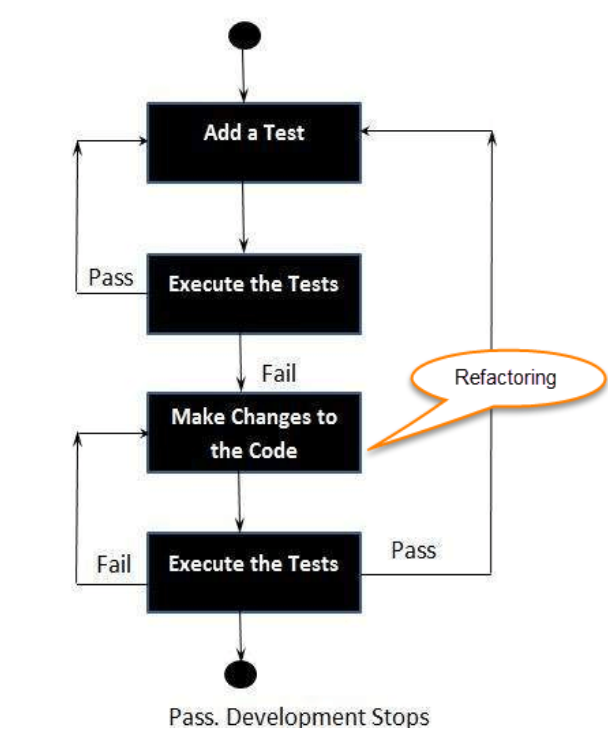

# Unit 2

## Unit Testing

This is where we test individual components. Usually done during development by the developers. Some tools are NUnit, JUnit, JMockit. Automated ones are EMMA (for java) and PHPUnit. `assert` is a commonly used across languages for unit testing. 

While unit testing is very powerful it cannot catch all errors and cannot evaluate all execution paths.

---

## Test Driven Development

This is where we design and create tests for each application function and developers only writes new code when the automated test cases fail. This promotes reusing and minimizing code, while prioritizing requirements. It also allows easier documentation.

---

## Refactoring

This is the process of changing a software system without altering external behavior while improving architecture. This helps minimise code thrashing. This is where 2 developers introduce conflicting changes.