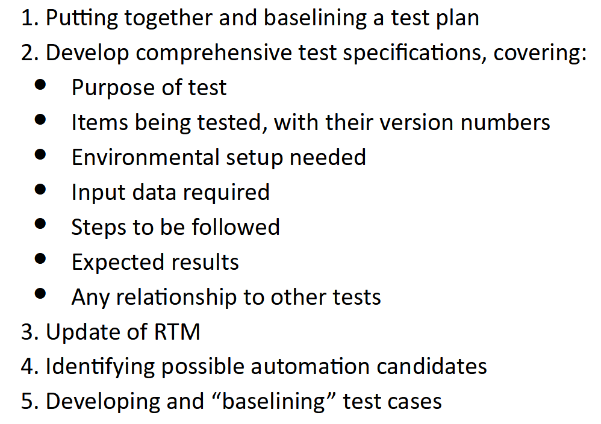
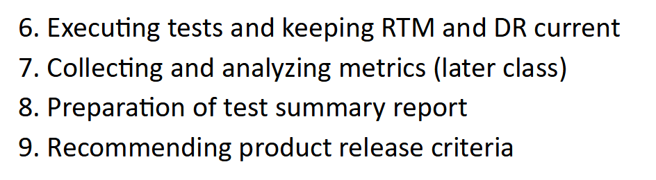

# Unit 3

### Black box Testing:

Black box testing is a technique of software testing which examines the functionality of software without peering into its internal structure or code.

Black box testing generally has 3 "uses":

- Functional testing: This is testing the main functionality of the program/product. Generally done by the software engineers.

- Non functional Testing: This is testing things like performance, responsiveness, reactivity, scalability etc. 

- Regression Testing: This is ensuring that the program/project is up to or better than the standards as it was before changes were made to the code.

There are a few tools used in regression testing. QTP, Selenium for func and regression testing. LoadRunner and Jmeter for non func.

We do black box testing ,in general, to improve the user experience, rather than improving the code.

#### Black box testing techniques:

- **Requirement based**
  
  - Requirements Traceability Matrix

- **Positive and negative**
  
  - Positive testing ensures that the valid data is accepted and processed correctly.
  
  - Negative testing ensure that the invalid data is not accepted and dealt with in a matter such that the program does not crash.

 

 

- **Specification based**
  
  - Equivalence partitioning: This divides the input data into multiple equal parts from which test cases can be derived. All inputs in one part must exhibit similar or same behavior to each other. This is essentially creating "classes" of inputs.
  
  - Boundary value analysis: This is giving the edge cases as test cases.
  
  - Decision tables: This is a techniques where we test the business logic and rules. This is a very good way to handle testing a sequence of inputs or a combination of inputs. Remember this is a *table* not a *flowchart*.
  
  - State based: This is where we test the programmatic logic. We test based on finite state machines and ensure the program follows the rules set by the FSM.

---

### Gray Box Testing

This is essentially black box testing but with some access to internal structure and code. 

All testing is done like black box. This means that we do not test the source code but rather the algorithms and structure, yadda yadda.

This is often seen done casually by software engineers during development. However this is not restricted to them.

In gray box we take inputs valid for black box testing or white box testing. We run tests like black box while going deeper into the parts of the project/ program.

##### Grey box testing techniques:

- Matrix testing: This is defining and testing all variables in a program.

- Regression testing: Same as black box.

- Orthogonal Array Testing: No info provided.

- Pattern Testing: This is testing done on historical system defects and tries to understand the root cause of the defect.

---

## Test Management

A lot of this is repeat of Unit 1 and 2. 

We have to:

1. Set up criteria for testing

2. Identify Skill sets and training

3. Identify environment needs

4. Identify test deliverables

5. Test Estimation(size, effort resources, time)

6. Dependencies
   
   - External:
     
     - Product developers
     
     - Documents
     
     - Hiring resources
     
     - Training resources
     
     - Hardware availability
     
     - etc
   
   - Internal:
     
     - Test specifications
     
     - Code/Scripting tests
     
     - Execution of tests
     
     - Conflicts with enc etc

7- Manage risks taken

 

### Test Process:

### Test Reporting

Test Incidence report, Test cycle report, Test summary report

---

## Defect Management Process (DMP)

Life cycle of a defect:

1. Discovery

2. Category

3. Resolution

4. Verification

5. Closure

6. Report

A defect is a problem or error in the code. DMP is used to:

- Prevent and detect defects

- Resolve and mitigate defect impact

- Improve software development process

### Stages of DMP:

1. **Defect prevention:** This is basically best practices and all that sort.

2. **Deliverable baseline:** This is regular baseline stuff. 

3. **Defect Discovery:** Identify=>Report=>Acknowledge.

4. **Defect Resolution:** Prioritize=>Fix=>Report

5. **Process Improvement:** This is looking into lower priority defects.

6. **Management Report:** Evaluation and reports all defects.

---

## Acceptance Testing

This is testing done with customer criteria in mind. Alpha and beta testing generally come here.

---