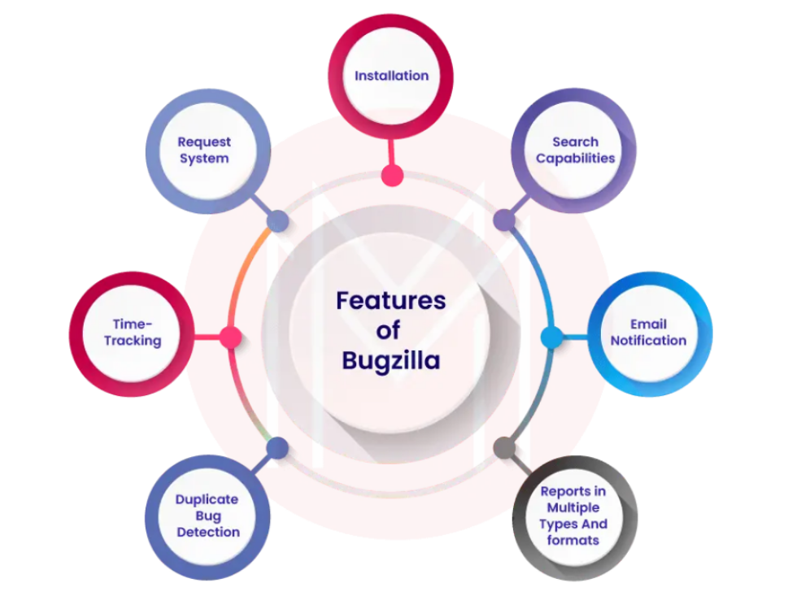

# Unit 4

## Non-functional testing

A few NFT tools are LoadRunner, JMeter, PerformanceTester, LoadUI and Silk Performer

- Reliability: Testing the system's ability to work under various requirements and iterations, within product requirements.

- Scalebility: Testing the ability of the system to handle increasing amounts of work without an unacceptable amount of performance degradation.

- Performance: Testing the response time.

- Stress: Testing the system's ability to function outside of the product requirements.

- Interopability: Testing the system's ability to communicate with other systems.

- Security: Testing vulnerability and security of the system.

- Compatibility: Testing the system's ability to work with other systems.

In non functional testing defect reproduction and fixing is harder. This is because these tests are not directly challenging one part of the code.

### Reliability Testing

Reliability is defined as the number of operations in a specific environment. Also can be considered the probability of failure-free software operation in a specified period of time.

### Stress Testing

This is tested by randomly applying stress conditions and measuring the effects. This is tested in a similar way to reliability tests. Stress test are both high loads or low resources.

### Performance Testing

This is measuring how "fast" the system is.

### Security Testing

This is general security testing.

---

### Test Analysis

Often in non-functional testing we analyse the results using graphs or charts.

---

## Regression Testing

This is selective retesting of system with the objective of ensuring that the bug fixes work and to ensure that there aren't new bugs or side-effects surfacing due to the changes.

Full regression testing is testing the "final golden" build. Regular regression testing is testing between cycles.

Smoke tests are a subset of test cases that cover the most important functionality of a component or system, used to aid assessment of whether main functions of the software appear to work correctly.

---

### Test case classification

#### Priority 1:

- Sanity test, usually run before the other tests

- These test make a large impact.

#### Priority 2:

- Generally these tests need low setup.

- They have a medium large impact on the project. Generally selected for regression tests.

#### Priority 3:

- These generally have a large setup.

- These are usually NFTs and don't have a big impact on the project.

After a test cycle concludes, during the next run we will often "reset" test cases. This is done based on:

- Priority

- Regression

- All

- Random

- Context based

All of these are **regression** tests.

---

## Agile and ad-hoc testing

Iterative testing is just testing at whatever the current requirement is.

Agile testing is testing that follows the guiding principles of agile. This is in the form of impact assessment, planning, daily meeting/stand-ups and reviews.

Defect seeding is where we intentionally introduce bugs to check the detection rate and effectiveness.

Ad-hoc testing is when we perform tests with low or no documentation and planning. This is generally done after the formal tests. There are a few versions of this.

- Monkey testing is randomly testing after formal tests.

- Buddy testing is a partner checking your code and finding errors.

- Exploratory testing is just exploring new technology.

- Pair testing is using a more experienced person to help you.

- Iterative testing is old walla.

- Extreme testing is sitting with customers and performing tests.

---

### Testing tools

Generally they are split into 2 types. Static testing, path tests and coverage analyzers, and dynamic testing, test beds and emulators.

#### Selenium:

This is an automated testing tool that can be used to test ONLY web applications.

| Advantages                     | Disadvantages                              |
| ------------------------------ | ------------------------------------------ |
| Open source                    | No official support                        |
| Extensible                     | Only web applications                      |
| Parallel test runs             | Slower rate of automation                  |
| Various OS and browser support | Cannot access anything outside the browser |

---

### Test management tools

This is used to store information about the tests. All possible metadata, when how what etc.

#### Bugzilla:

This is an open source bug tracking software, known for its robust search features.

| Advantages                                            | Disadvantages                     |
| ----------------------------------------------------- | --------------------------------- |
| Open source                                           | Bad with agile.                   |
| Enhances communication between testers and developers | Cannot drag and drop issues.      |
| Extensive search capabilities                         | Poor UI                           |
|                                                       | Does not support kanban projects. |

#### Jira:

This is a commercial agile and bug tracking software. It excels at project and task management as well as agile planning.

| Advantages                                                  | Disadvantages                               |
| ----------------------------------------------------------- | ------------------------------------------- |
| Has integrations with a lot of external programs            | Commercial tool with various pricing models |
| Suitable for various teams, testers, developers or managers | Complex for new users                       |
| Simple and intuitive interface                              | Loads slowly for large volumes of data.     |